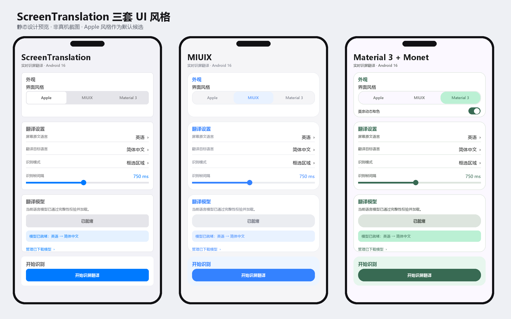
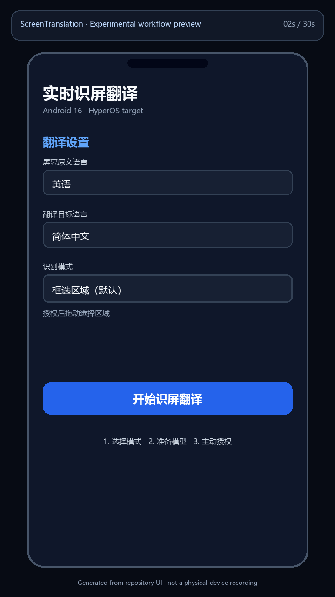

# ScreenTranslation

**简体中文** | [English](README.en.md)

> v2.1.0 提供三套可切换界面：Apple 风格默认主题、MIUIX，以及支持可关闭
> Monet 动态取色的 Material 3。参见 [UI 风格设计与边界](docs/UI_STYLES.md)。



面向 **Android 16（API 36）/ 小米 15 Pro / HyperOS** 的实时识屏翻译原生应用。用户在前台主动启动一次任务后，应用通过 Android 的屏幕共享授权读取画面；默认只裁剪用户框选区域，Experimental 模式则对全屏变化分块增量识别。在本机完成 OCR 后，应用按所选 edition 进行端侧或在线翻译并用悬浮层显示结果。

> 项目状态：面向单一设备/ROM 基线的 `v2.1.0`。运行基线为 Android 16 / API 36，`minSdk` 与
> `targetSdk` 为 36，`compileSdk` 为 37。源代码采用
> [Apache License 2.0](LICENSE)，各第三方组件仍受自身条款约束。

## 30 秒工作流预览



该动画由 [`scripts/generate_demo_preview.py`](scripts/generate_demo_preview.py)
从仓库当前 UI 规则确定性生成，用于展示交互目标，**不是真机录屏**。历史签名
Release 证据与最终 v2.1.0 真机门禁清单位于
[`docs/DEVICE_TEST.md`](docs/DEVICE_TEST.md)。最终候选由带 source SHA 的签名
acceptance Artifact 固定，持续识别结果写入 Issues #38/#39，并由发布工作流把同一组字节原样提升到
GitHub Release。

## 功能

- 用系统 `MediaProjection` 授权捕获屏幕，不使用无障碍服务。
- 可拖拽框选识别区域，并可调节采样间隔。
- 保留“框选区域”为默认模式；新增 **全屏增量覆盖（Experimental）**：按 `3×6`
  分块检测画面变化；直接从 `Image.Plane` 计算亮度签名，静态帧在构造 Bitmap 前退出；
  只对脏块 OCR，跨帧跟踪文字框，并把译文直接覆盖在对应原文上方。标签会避开系统
  安全区、控制条和其他译文，找不到合法空位时不叠放。
- 静态画面自动降低采样频率，检测到变化后恢复用户设置的活跃频率。
- 翻译前以确定性规则恢复高置信独立块句尾、段落句界和缺失右侧成对标点；单换行视觉折行保持原样，URL、邮箱、日期、金额、小数和版本号先保护后逐字节恢复。
- 结果面板可分别复制原文和译文；模型管理页可查看状态、大小、固定版本，直接发起当前语言模型准备，并删除下载权重。准备成功后主页面按钮变为灰色不可点击的“已就绪”；界面重建时会先复核当前应用私有模型/配置 identity，冷进程与服务启动仍执行完整固定 SHA-256 校验，切换语言对或配置后恢复准备动作。
- 内置 PP-OCRv6 small 多语言检测/识别模型，通过 ONNX Runtime 在设备端运行。
- **Lite · Bergamot**：英语直译中文、日语经英语级联译中文；保留 v0.1.0
  包名并支持签名升级。
- **Full · HY-MT2 Q4 Experimental**：多语言直接译为简体中文，使用独立
  `.full` 包名，可与 Lite 并存安装。
- **Online · BYOK API**：使用独立 `.online` 包名；填写 OpenAI-compatible
  HTTPS Base URL 与 API Key，自动拉取模型后翻译；区域模式发送稳定整段文字，
  全屏模式只发送稳定的变化文字块，不发送截图或坐标。
- Lite/Full 的翻译模型按需下载、校验后在设备端推理；Online 不携带翻译模型；
  模型权重均不进入 APK/AAB。
- 三个 APK/AAB 都内嵌适用的完整第三方许可证与 notices；GitHub Release
  另附统一 `THIRD-PARTY.zip`，包含 Bergamot MPL 对应源码坐标。
- 文本稳定后才触发翻译，避免同一画面反复识别与闪烁。
- 前台服务常驻通知明确显示捕获状态，可从应用或系统界面停止。
- 明暗主题、Android 16 edge-to-edge 及 HyperOS 悬浮窗权限流程。
- Online 对 401/403、429、超时、DNS/TLS、端点/模型和响应格式给出可执行提示；
  HTTP 408/429/502/503/504 与可恢复的一般 I/O 失败做一次有界重试，生成超时、
  DNS 和 TLS 错误不重试。

## 技术基线

| 项目 | 版本/配置 |
|---|---|
| Android Gradle Plugin | application 9.3.1 / library 9.3.1 |
| Gradle Wrapper | 9.6.1 |
| JDK | 17 |
| Kotlin | AGP 9.3 内置 Kotlin（不应用 `org.jetbrains.kotlin.android`） |
| compile / min / target SDK | 37 / 36 / 36 |
| APK ABI | `arm64-v8a`（小米 15 Pro 目标构建） |
| Production OCR | PP-OCRv6 small ONNX，固定检测/识别模型提交 |
| OCR runtime | ONNX Runtime Android `1.28.0` |
| Lite translation | Bergamot `v0.4.5+9271618` + Firefox en→zh / ja→en `base-memory` |
| Full translation | Hy-MT2 1.8B Q4_K_M + llama.cpp `b10181`，Experimental |
| Online translation | OkHttp `5.4.0` + 用户配置的 OpenAI-compatible Chat Completions |
| Benchmark baseline | ML Kit Translate `17.0.3` |
| Low-bit translation PoC | Hy-MT2 1.8B STQ1_0 1.25-bit + llama.cpp PR `#22836` |
| Provider policy | 类型化语言/输入/存储/取消/性能/归属画像与中间档门禁，见 [`docs/TRANSLATION_PROVIDER_PROFILES.md`](docs/TRANSLATION_PROVIDER_PROFILES.md) |

PP-OCRv6 检测模型、识别模型和字符表随 APK/AAB 打包，运行时无需下载 OCR
权重。首次构建会从 PaddlePaddle 官方仓库获取约 31 MB 的固定 ONNX 资产，
逐个校验 SHA-256 后才参与打包。Lite 的英语模型解压后约 47.6 MiB，启用
日语时再增加约 52.2 MiB；Full 的 Q4 模型为 1,133,080,448 bytes。
翻译模型保存在各 edition 的应用专属 `no_backup` 目录。

Bergamot Android ARM64 长驻 runner 已进入 Lite APK。扩展后的 40 条英中与
40 条日中对比显示，英中 Bergamot 质量略优；日中 `ja→en→zh` 级联与
ML Kit 互有胜负，但中位延迟更高且峰值 RSS 约 767.63 MiB。初始 PoC 与
压力测试见
[`docs/BERGAMOT_ANDROID_POC_2026-07-29.md`](docs/BERGAMOT_ANDROID_POC_2026-07-29.md)，
多元英/日中报告见
[`docs/TRANSLATION_BENCHMARK_EN_JA_ZH_2026-07-29.md`](docs/TRANSLATION_BENCHMARK_EN_JA_ZH_2026-07-29.md)。

面向后续模型替换的 `2026.08-public-v2-original-references` 回归发布包含 48 条
英中与 48 条日中，逐条登记来源/许可并固定 SHA-256；候选采用 canonical corpus
join 的最小严格 schema，并检测 Unicode/不可见字符/标点变体覆盖至少 90% 的 replay。
Lite/Full/Online 自动阈值、category/tag protected 硬门、从原始评分重算且双向绑定
candidate+baseline 的盲评、绑定完整执行链但仅证明当前 checkout 新鲜度的 Kotlin Online
challenge，以及伪名评分者尚未验签、缺少 canonical incumbent pin / authenticated reviewers /
可信 runner attestation 时 `release_ready: false` 的边界见
[`docs/TRANSLATION_QUALITY_REGRESSION.md`](docs/TRANSLATION_QUALITY_REGRESSION.md)。

Hy-MT2 1.8B Q4_K_M 已进入 Full Experimental edition；STQ1_0
1.25-bit 仍为受 fail-closed gate 约束的 standalone PoC：当前 llama.cpp PR
`#22836` 是 `OPEN`，仓库 gitlink `caa596…` 也没有 merge-ancestry 证据；只有 PR
变为 `MERGED`，且 CI 证明实际 gitlink 包含 merge 并核对 runnable GGUF hash 后才重新开放候选验收。Q4 是当前质量上限；1.25-bit 相对
ML Kit/Bergamot 仍有 `6.9–9.5` BLEU 优势，但只保留 Q4 的
`88.4–93.4%` BLEU，日中关键语义检查也低于 Bergamot。
1.25-bit 模型为 440.46 MiB、standalone runner HWM 约 0.88 GiB，资源比 Q4 低约 59%，
raw 中位延迟仍为 `616–622 ms`。四模型数据、格式兼容过程和验收结论见
[`docs/HY_MT2_TRANSLATION_BENCHMARK_2026-07-30.md`](docs/HY_MT2_TRANSLATION_BENCHMARK_2026-07-30.md)。
官方 source GGUF、retag runnable GGUF、转换 manifest 及“集成 Release/持续热测未测”
均进入 fail-closed canonical admission：source declaration、验证器根据实时 PR/gitlink/
artifact 重算的 strict record 与 SHA pin 见
[`docs/evidence/hymt2-stq-admission-source-v1.json`](docs/evidence/hymt2-stq-admission-source-v1.json)
和 [`docs/evidence/hymt2-stq-admission-v1.json`](docs/evidence/hymt2-stq-admission-v1.json)。
CI 会重算这条证据链；应用只解析生成的固定 JSON，不接收调用方填写的 ancestor/verified
布尔值，当前所有未提供测量都保持 JSON `null` 并阻断选择。

Full · HY-MT2 Q4 Experimental 的 v0.2.0 签名 Release 已在小米 15 Pro /
Android 16 上完成真机验收：应用内固定长句自检在 `22.579 s` 和
`20.724 s` 两次通过，完整识屏链路运行 PSS 为 `2,314,830 KiB`；
五轮快速启停后再次推理仍通过。`MediaProjection → PP-OCRv6 →
HY-MT2 Q4 → 悬浮窗` 使用无标题干扰的英文长句页验证了完整译文。
该 edition 用于质量、内存和静止画面链路验证，不代表持续识屏默认方案。
签名 Release 实测见 [`docs/DEVICE_TEST.md`](docs/DEVICE_TEST.md)。

## 工程结构

```text
app/src/main/java/com/screentranslation/app/
├── MainActivity.kt                  # 权限、语言和采样设置
├── capture/
│   ├── BitmapExtractor.kt           # Image -> Bitmap 与区域裁剪
│   ├── FrameProcessor.kt            # 单飞帧处理与 edition 分流
│   └── TranslationCoordinator.kt    # Online latest-wins/取消/限流/内存缓存
├── ml/
│   ├── OcrEngine.kt                 # OCR 生命周期与结果契约
│   ├── PpOcrv6Engine.kt             # PP-OCRv6 + ONNX Runtime 生产实现
│   ├── TranslationEngine.kt         # edition 翻译接口与工厂
│   ├── TranslationProviderProfile.kt # 类型化能力与中间档阈值
│   └── TranslationAdmissionRecord.kt # strict canonical STQ admission parser
├── overlay/
│   ├── OverlayController.kt         # 框选层和译文层
│   └── RegionSelectionView.kt       # 区域交互
├── prefs/AppPreferences.kt          # 用户设置
├── service/ScreenTranslationService.kt
└── util/StableTextGate.kt           # OCR 去抖/稳定门

app/src/lite/
├── java/.../BergamotTranslationEngine.kt # 模型下载、校验与长驻 runner
├── jniLibs/arm64-v8a/libbergamot_runner.so
└── cpp/                              # 固定源码输入与可复现重建脚本

app/src/full/
└── java/.../HyMt2Q4TranslationEngine.kt  # Q4 下载、校验与本地推理

app/src/online/
├── java/.../OnlineLlmTranslationEngine.kt # 用户 API 在线翻译后端
├── java/.../online/                       # Endpoint、Keystore、模型目录与设置页
└── res/                                   # Online 标签与配置界面

app/src/benchmark/
└── java/.../TranslationEngine.kt     # ML Kit Translate 对照

llama-android/                        # JNI/Kotlin Android 推理封装
third_party/llama.cpp/                # 固定提交的 Git submodule
```

设计细节见 [`docs/ARCHITECTURE.md`](docs/ARCHITECTURE.md)，全屏增量算法与签名门禁
门禁见 [`docs/FULL_SCREEN_INCREMENTAL_DESIGN.md`](docs/FULL_SCREEN_INCREMENTAL_DESIGN.md)，真机验收见
[`docs/DEVICE_TEST.md`](docs/DEVICE_TEST.md)，PP-OCRv6 与候选翻译模型的可复现
数据见 [`docs/MODEL_BENCHMARK_2026-07-28.md`](docs/MODEL_BENCHMARK_2026-07-28.md)，
持续识别 A/B、温控和内存证据见
[`docs/PP_OCRV6_SUSTAINED_BENCHMARK_2026-08-11.md`](docs/PP_OCRV6_SUSTAINED_BENCHMARK_2026-08-11.md)，
Bergamot Android 核心 PoC 见
[`docs/BERGAMOT_ANDROID_POC_2026-07-29.md`](docs/BERGAMOT_ANDROID_POC_2026-07-29.md)，
多语言翻译质量对比见
[`docs/TRANSLATION_BENCHMARK_EN_JA_ZH_2026-07-29.md`](docs/TRANSLATION_BENCHMARK_EN_JA_ZH_2026-07-29.md)，
Hy-MT2 综合对比见
[`docs/HY_MT2_TRANSLATION_BENCHMARK_2026-07-30.md`](docs/HY_MT2_TRANSLATION_BENCHMARK_2026-07-30.md)，
云端 Hy-MT2/TranslateGemma 质量、GPU、流量与选型见
[`docs/CLOUD_MODEL_BENCHMARK_2026-08-01.md`](docs/CLOUD_MODEL_BENCHMARK_2026-08-01.md)，
Online edition 设计见
[`docs/ONLINE_TRANSLATION_DESIGN.md`](docs/ONLINE_TRANSLATION_DESIGN.md)。

## 构建

### 前置条件

- JDK 17
- Android SDK Platform 36 与 37
- Android SDK Build Tools 37.0.0
- Android NDK 29.0.14206865 与 CMake 3.31.6（Full）
- Android NDK 23.1.7779620（重新构建 Lite Bergamot runner 时使用）
- Git

Android Studio 安装 SDK 后，在未跟踪的 `local.properties` 中指向本机目录：

```properties
sdk.dir=C\:\\Android\\Sdk
```

检查环境：

```bash
java -version
./gradlew --version
```

Windows PowerShell 使用：

```powershell
java -version
.\gradlew.bat --version
```

获取 llama.cpp 固定提交：

```bash
git submodule update --init --recursive
```

首次执行构建任务时，`preparePpOcrv6Assets` 会下载并校验固定版本的
PP-OCRv6 small 资产。后续构建会复用校验通过的
`app/build/generated/ppocrv6Assets`。

### 三 edition 编译、测试与 Lint

Linux/macOS：

```bash
./gradlew --no-daemon clean \
  testLiteDebugUnitTest testFullDebugUnitTest testOnlineDebugUnitTest \
  lintLiteRelease lintFullRelease lintOnlineRelease \
  assembleLiteRelease assembleFullRelease assembleOnlineRelease
```

Windows：

```powershell
.\gradlew.bat --no-daemon clean `
  testLiteDebugUnitTest testFullDebugUnitTest testOnlineDebugUnitTest `
  lintLiteRelease lintFullRelease lintOnlineRelease `
  assembleLiteRelease assembleFullRelease assembleOnlineRelease
```

APK 输出：

```text
app/build/outputs/apk/lite/release/app-lite-release-unsigned.apk
app/build/outputs/apk/full/release/app-full-release-unsigned.apk
app/build/outputs/apk/online/release/app-online-release-unsigned.apk
```

配置 `keystore.properties` 或 `ANDROID_RELEASE_*` 环境变量后，文件名中的
`-unsigned` 会变为已签名的 `app-lite-release.apk`、`app-full-release.apk` 或
`app-online-release.apk`。签名流程见 [`docs/RELEASING.md`](docs/RELEASING.md)。

### Android 16 instrumentation

捕获生命周期的 Android 测试使用隔离的 `onlineInstrumentation` 变体，只生成
x86_64 Debug 签名包并在 API 36 模拟器运行：

```bash
./gradlew :app:connectedOnlineInstrumentationAndroidTest
```

该任务覆盖启动与权限前置、区域/全屏状态、旋转、屏幕开关、任务移除、投影撤销和
磁盘隐私。它是持续集成回归，不替代 ARM64 签名 Release/R8 真机验收。环境准备、
产物路径和 Windows 多设备运行方式见
[`docs/INSTRUMENTATION_TESTING.md`](docs/INSTRUMENTATION_TESTING.md)。

### Lite · Bergamot

Lite 使用 `com.screentranslation.app` 和 `2.0.0-lite`，可覆盖升级 v0.1.0。
APK 随包提供固定的 ARM64 Bergamot runner；构建时
`verifyBergamotRunner` 校验其 8,416,304 bytes 与 SHA-256。英语→中文使用
直模，日语→中文使用 `ja→en→zh` 级联。压缩模型和解压文件均校验长度与
SHA-256。

维护者可在 Linux / WSL 中用
`app/src/lite/cpp/build-prebuilt.sh` 从固定 Bergamot commit 与 NDK r23b
重建 runner；脚本要求生成结果命中发布清单哈希。

### Full · HY-MT2 Q4 Experimental

Full 使用 `com.screentranslation.app.full` 和 `2.0.0-full`，可与 Lite
并存。应用名称、标题、Banner、通知和 attribution 均包含
`Full · HY-MT2 Q4 Experimental`。

首次点击“准备 Hy-MT2 Q4 实验模型”或“运行 Hy-MT2 Q4
集成自检”时，应用从固定版本下载官方 `Hy-MT2-1.8B-Q4_K_M.gguf`，校验
`1,133,080,448` 字节及 SHA-256
`dc5f44fcf1fa496ee7ad725982c0c8c553a4de00259b53af84c4b89fb0c06699`，
再保存到应用内部 `no_backup/models/hymt2-q4`。Full 当前只输出简体中文；
内置固定英文长句自检会实际加载 JNI/llama.cpp 并显示原文、译文和总耗时。

### Online · BYOK API

Online 使用 `com.screentranslation.app.online` 和 `2.0.0-online`，可与 Lite/Full
并存。设置页只保留用户自带密钥（BYOK）链路：填写 HTTPS Base URL 与 API Key、
确认数据流，再点击“获取可用模型”；应用通过 `GET /models` 获取并展示模型 ID，
无需手工输入。根地址会自动补充 `/models` 和 `/chat/completions`。API Key 由
Android Keystore 加密，截图不会上传。稳定 OCR 以整段单请求发送；协调器采用 600 ms
去抖、750 ms 最小间隔、单活跃请求和单 latest pending，停止、重选区域或息屏会
取消请求。网络客户端使用 connect/write/read/call `15/30/75/90 s` 的有界超时；
生成请求超时不会自动重试，避免重复用量。稳定 OCR 会先显示，再进入在线翻译状态，
便于区分本机识别等待与网络等待。

DeepSeek 官方 API 可直接填写 `https://api.deepseek.com`，获取模型后选择
`deepseek-v4-flash`。针对该官方主机的 DeepSeek V4 请求，应用会显式关闭思考模式，
避免纯翻译任务产生额外推理 token 和延迟；该兼容字段不会发送给其他
OpenAI-compatible 服务。2026-08-01 的 40 条英中与 40 条日中主机网络实测见
[`docs/CLOUD_MODEL_BENCHMARK_2026-08-01.md`](docs/CLOUD_MODEL_BENCHMARK_2026-08-01.md#用户-api--deepseek-v4-flash)。
2026-08-02 又在 Xiaomi 15 Pro / Android 16 / HyperOS 上完成 `/models`、配置加密
保存、真实 Chat Completions，以及
`MediaProjection -> PP-OCRv6 -> DeepSeek -> 悬浮译文` 的跨应用闭环；详情见
[`docs/DEVICE_TEST.md`](docs/DEVICE_TEST.md#2026-08-02-online-byok--api-真机验收)。

受硬件和长期运营条件限制，Online Release 不内置项目托管模型、公共 API Key 或
维护者网关；所有网络请求只发往用户在设备上确认的服务主机。

### 安装

启用 Android 16 设备的开发者选项和 USB 调试后：

```bash
adb devices -l
./gradlew :app:installLiteDebug :app:installFullDebug :app:installOnlineDebug
adb shell am start -n com.screentranslation.app/.MainActivity
adb shell am start -n com.screentranslation.app.full/.MainActivity
adb shell am start -n com.screentranslation.app.online/.MainActivity
```

Windows 将 `./gradlew` 替换为 `.\gradlew.bat`。

## 首次使用顺序

1. 打开应用，选择源语言和采样间隔。Lite 提供英语/日语→简体中文；Full
   提供界面列出的非中文源语言→简体中文；Online 可使用界面列出的源/目标语言，
   先在 Online 设置页填写自己的 API 并确认数据流。PP-OCRv6 使用同一套多语言权重。
2. 点击悬浮窗授权；HyperOS 会打开本应用权限编辑页，进入“其他权限 → 显示悬浮窗 → 始终允许”。
3. Android 13+ 首次运行时允许通知；拒绝后，系统仍可能在任务管理界面显示前台服务，但用户体验不完整。
4. 点击开始，接受 Android 系统的“共享/录制屏幕”提示。每个捕获会话都必须使用新的授权结果。
5. 在目标应用拖动框选需要识别的屏幕区域；最小边长 32dp。框选画面保持透明，
   只显示顶部单条提示；边缘返回手势会取消本次框选，而不会让目标应用返回上一页。
6. 首次使用语言路线时保持联网，等待模型下载与哈希校验。后续可断网测试设备端
   翻译。
7. 使用悬浮窗或运行通知停止；停止后通知栏保留“开始识屏”，可在目标应用直接重启。

## HyperOS 注意事项

- `SYSTEM_ALERT_WINDOW` 是特殊权限，不能用普通运行时权限弹窗授权；必须由用户在系统设置页开启。
- Android 15 QPR1+ 会在锁屏时结束当前 `MediaProjection`。应用会立即释放采集资源并发布“屏幕共享会话已结束”通知；解锁后点按通知，再次通过系统授权即可继续。
- 若亮屏长时间运行时服务被 HyperOS 提前回收，可在应用详情的“省电策略”中选择
  “无限制”后复测；应用会读取目标 ROM 的精确包名列表显示识别结果。该设置不会
  保留锁屏后已失效的投影令牌。
- 不需要“自启动”、无障碍服务、读取相册、麦克风或联系人权限。
- Android 16 的每个新捕获会话都使用新的屏幕共享授权结果。
- 目标 HyperOS 版本会把应用悬浮层混入 MediaProjection 帧；本应用会在
  OCR 前遮蔽悬浮层的实际屏幕区域，避免原文和译文被递归识别。
- 本应用自己的译文悬浮窗不设置 `FLAG_SECURE`，因此用户发起的系统截图和
  录屏可以包含译文面板；上述 OCR 前坐标遮罩只作用于应用内部识别链路。
- 银行、密码管理器、流媒体 DRM 等使用 `FLAG_SECURE` 的窗口会返回黑屏/空白，这是系统隐私边界。

## 隐私边界

- 屏幕帧只在进程内存中处理，不落盘。
- OCR 始终在设备端进行。Lite/Full 翻译在设备端推理；Online 只把稳定后的 OCR
  文本、语言、模型 ID 和固定提示发送到用户选择的 API。
- Lite 的 Firefox Translations 模型与 Full 的 Hy-MT2 Q4 模型均保存在各自
  应用内部 `no_backup` 目录，不进入系统备份。
- 应用仅保存源/目标语言和采样间隔，不保存选择区域、截图或识别历史。
- 停止服务时释放 `VirtualDisplay`、`MediaProjection`、`ImageReader`、OCR/翻译客户端和悬浮窗。
- 项目代码不上传屏幕图像；Online 之外的生产 edition 不上传 OCR 原文或译文。
- v2.1.0 Lite / Full / Online APK 不携带 ML Kit Translate；该组件只保留在
  `benchmark` build type。完整数据流见 [`PRIVACY.md`](PRIVACY.md)。
- Online edition 的数据发送确认、密钥存储和请求边界见
  [`docs/ONLINE_TRANSLATION_DESIGN.md`](docs/ONLINE_TRANSLATION_DESIGN.md)。

## 已知边界

- 当前只适配 Android 16，不保证低版本 Android 或其他厂商 ROM。
- 当前 APK 只打包 `arm64-v8a`，用于小米 15 Pro 真机；如需 x86_64 模拟器，应调整 `abiFilters` 后重新构建。
- PP-OCRv6 使用一套多语言识别模型；当前 UI 仅开放已列出的源语言，混合文字、
  小字号和艺术字体仍需按真机夹具验收。
- 动画、游戏或快速滚动画面会受采样间隔、设备温度和文字清晰度影响。
- 系统级安全窗口、工作资料策略和部分视频内容不可被捕获。
- 长结果默认折叠，可通过展开模式在限高面板内滚动查看。
- Lite 只开放已经真机测量的英语→中文和日语→英语→中文路线。Mozilla 当前
  没有直接日中模型，级联的模型体积和内存明显高于英中直模；v0.2.0
  签名 Release 的纯日文长句复测仍出现明显语义和语序退化，因此日中路线
  当前只承诺离线链路可用，不把译文质量视为与 Full 等价。
- Full · Hy-MT2 Q4 单次应用内长句自检约 20 秒，峰值 RSS 约 2.32 GiB，
  因而明确标记 Experimental，并优先用于静止画面和翻译质量验证。1.25-bit 仍为 standalone
  PoC，并依赖开放中的专用 kernel PR；当前官方 GGUF 与 PR 重排后的类型号
  需要可审计的 header 兼容处理。
- Online 的翻译质量、延迟、配额、日志留存和可用语言由用户选择的服务与模型决定；
  `/models` 返回的是账号可见模型，不保证每个模型都接受 Chat Completions，需使用
  “保存并测试翻译”验证所选模型；
  当前已覆盖 DeepSeek V4-Flash 的真实 API、长句真机持续识屏闭环、长响应超时策略
  与正常网络回归；localhost HTTPS 契约测试已覆盖 401/429/超时，真实服务限流、
  latest-wins 压力和长时间运行仍按
  `docs/ONLINE_TRANSLATION_DESIGN.md` 的验收矩阵继续执行。
## 开源维护

- 贡献流程：[`CONTRIBUTING.md`](CONTRIBUTING.md)
- 行为准则：[`CODE_OF_CONDUCT.md`](CODE_OF_CONDUCT.md)
- 路线图：[`docs/ROADMAP.md`](docs/ROADMAP.md)
- 安全报告：[`SECURITY.md`](SECURITY.md)
- 隐私与数据流：[`PRIVACY.md`](PRIVACY.md)
- 支持范围：[`SUPPORT.md`](SUPPORT.md)
- 项目治理：[`GOVERNANCE.md`](GOVERNANCE.md)
- 维护者手册：[`docs/MAINTAINING.md`](docs/MAINTAINING.md)
- 发布流程：[`docs/RELEASING.md`](docs/RELEASING.md)
- 第三方组件：[`THIRD_PARTY_NOTICES.md`](THIRD_PARTY_NOTICES.md)
- 完整许可包：[`third_party/licenses/`](third_party/licenses/)
- 版本记录：[`CHANGELOG.md`](CHANGELOG.md)

## 参考

- [Android Media projection](https://developer.android.com/media/grow/media-projection)
- [Android foreground service types](https://developer.android.com/develop/background-work/services/fgs/service-types)
- [PP-OCRv6 small detection ONNX](https://huggingface.co/PaddlePaddle/PP-OCRv6_small_det_onnx)
- [PP-OCRv6 small recognition ONNX](https://huggingface.co/PaddlePaddle/PP-OCRv6_small_rec_onnx)
- [ONNX Runtime Android](https://onnxruntime.ai/docs/build/android.html)
- [ML Kit Text Recognition v2（benchmark 基线）](https://developers.google.com/ml-kit/vision/text-recognition/v2/android)
- [ML Kit on-device translation](https://developers.google.com/ml-kit/language/translation/android)
- [ML Kit Android data disclosure](https://developers.google.com/ml-kit/android-data-disclosure)
- [Bergamot Translator](https://github.com/browsermt/bergamot-translator)
- [Firefox Translations models](https://mozilla.github.io/translations/firefox-models/)
- [Tencent Hy-MT2](https://github.com/Tencent-Hunyuan/Hy-MT2)
- [llama.cpp](https://github.com/ggml-org/llama.cpp)
