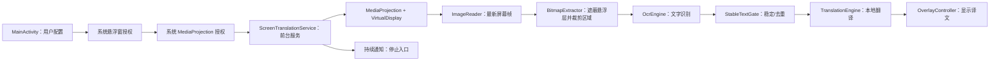
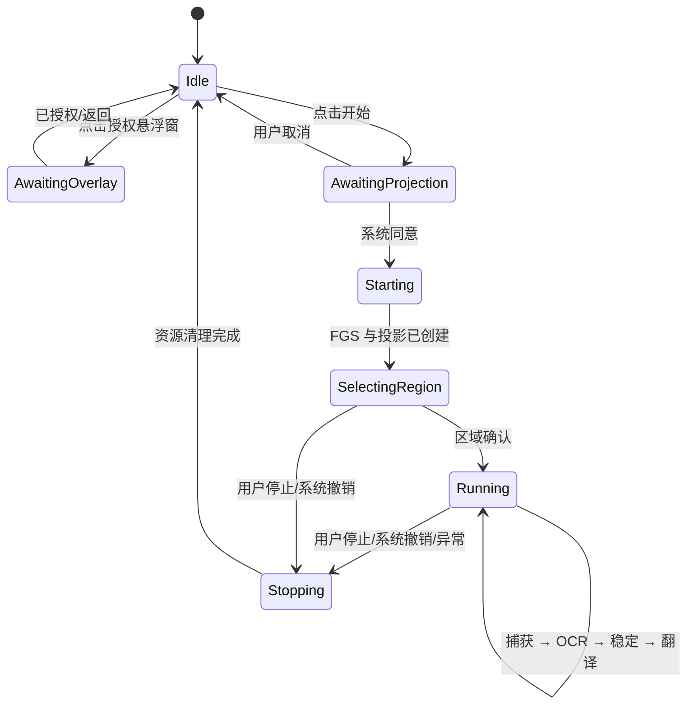

# 架构说明

## 1. 目标与约束

ScreenTranslation 是单 Activity、单前台服务的 Android 16 原生应用，目标设备为小米 15 Pro（HyperOS 最新稳定版）。设计优先级依次为：

1. 系统授权链正确，用户能随时看见并停止屏幕捕获。
2. 屏幕帧不落盘，OCR 与翻译在设备端完成。
3. 同一时刻最多处理一帧，避免积压、发热和翻译结果乱序。
4. 悬浮层职责单一，区域选择与译文展示互不混淆。
5. 所有长生命周期资源在停止、投影撤销或服务销毁时统一释放。

工程固定使用 API 36，因此不包含旧系统兼容分支。

## 2. 模块职责

| 组件 | 职责 | 生命周期/线程约束 |
|---|---|---|
| `MainActivity` | 收集语言、采样间隔和系统授权结果；发送显式 Intent 启停服务 | 只在前台发起 MediaProjection 授权 |
| `ScreenTranslationService` | 前台通知、投影会话、虚拟显示、整条流水线的所有权 | 启动后立即进入 FGS；销毁时幂等清理 |
| `OverlayController` | 添加/更新/移除区域选择层和译文层 | 所有 WindowManager 操作在主线程 |
| `RegionSelectionView` | 手势框选并将屏幕坐标区域提交给控制器 | 输出规范化、非空且位于可用显示区域内的矩形 |
| `FrameProcessor` | 限速、单飞处理、丢弃过期帧和串联 OCR/翻译 | 不允许并发处理两帧；结果带代次校验 |
| `BitmapExtractor` | 从 ImageReader 图像读取 stride，构造 Bitmap 并裁剪 | 每个 `Image` 均在 `finally` 中关闭 |
| `OcrEngine` | 为帧处理层提供统一 OCR 接口；生产实现为 `PpOcrv6Engine` | 单工作线程串行推理；关闭时释放 ORT session 与线程 |
| `StableTextGate` | 文本规范化、去空白抖动、稳定次数门限、重复抑制 | 纯 Kotlin，可单元测试 |
| `TranslationEngine` | 建立指定语言对 Translator、下载模型、提交翻译、关闭旧客户端 | 切换语言对时使旧回调失效 |
| `AppPreferences` | 保存源/目标语言和采样间隔 | 不保存选择区域、截图、OCR 文本或翻译历史 |

## 3. 数据流



### 3.1 捕获

1. Activity 在可见状态调用 `MediaProjectionManager.createScreenCaptureIntent()`。
2. 用户同意后，Activity 把本次 `resultCode` 和授权 `Intent` 交给显式启动的服务。
3. 服务先创建通知渠道并调用 `startForeground()`，然后取得 `MediaProjection`。
4. 按物理显示尺寸建立 `ImageReader` 与 `VirtualDisplay`。
5. `OnImageAvailableListener` 只获取最新一帧；处理繁忙时直接丢帧，不建立无界队列。

Android 14+ 规定一次授权结果只能创建一个投影会话。屏幕旋转、停止后重启或系统撤销投影时，不复用旧令牌；回到 Activity 重新请求。

Android 15 QPR1+ 在锁屏时结束当前投影。服务在
`MediaProjection.Callback.onStop()` 中标记会话失效，幂等释放
`VirtualDisplay`、`ImageReader`、OCR/翻译客户端和悬浮窗，然后发布一条
可自动清除的状态通知。用户解锁并点按通知后回到 `MainActivity`，界面说明
需要重新授权；新的投影只在用户再次接受系统确认页后创建。显式停止走普通
清理路径，不发布这条恢复通知。

### 3.2 OCR 与稳定门

- 区域选择使用屏幕坐标，裁剪前按当前捕获帧尺寸映射并夹紧边界。
- Debug/Release 使用 PP-OCRv6 small 检测与识别 ONNX 模型。模型和字符表固定
  到明确上游提交，构建时校验 SHA-256，随 APK/AAB 打包；运行时不下载 OCR 权重。
- `PpOcrv6Engine` 使用 ONNX Runtime Android 1.26.0、CPU execution provider、
  4 个 intra-op 线程、batch 1、检测最长边 640，并关闭 memory pattern 与 CPU arena。
  XNNPACK 在目标 HyperOS 上连续触发原生崩溃，因此生产配置保留已验收的 CPU 路径。
- 权重复制、字符表读取和 ORT session 创建在 OCR 工作线程首次使用时完成，
  前台服务主线程只装配管线，不执行模型文件 I/O。
- Release 的 R8 配置完整保留 `ai.onnxruntime.**`，CI 再从压缩后 APK 检查
  `OnnxTensor.createTensor` 与 `OrtSession.run` JNI 入口，避免仅凭构建成功放行。
- 一个多语言识别模型处理当前开放的中、英、日、韩、法、德、西班牙语画面；
  源语言选择用于后续翻译配置，不再切换 OCR 权重。
- `benchmark` 变体保留 ML Kit Latin/Chinese/Japanese/Korean 基线适配器，迁移
  前后的真机参数、内存与质量数据见
  [`MODEL_BENCHMARK_2026-07-28.md`](MODEL_BENCHMARK_2026-07-28.md)。
- OCR 结果先做首尾空白清理和连续空白归一化。
- `StableTextGate` 只放行达到稳定条件且不同于上次已提交内容的文本；
  即使整体相似度很高，持续两帧的单词或数字变化也会作为新内容提交。
- 若正在处理一帧，新到帧被丢弃；不会让旧画面的翻译覆盖新结果。

### 3.3 翻译

- `Translator` 的键是 `(sourceLanguage, targetLanguage)`。
- 新语言对先检查/下载对应模型，再接受翻译请求。
- 模型下载需要 `INTERNET`；模型可用后翻译在本地运行。
- 配置改变或服务结束时关闭旧 `Translator`，并通过会话代次丢弃迟到回调。

### 3.4 悬浮层

使用 `TYPE_APPLICATION_OVERLAY`，前置条件是 `Settings.canDrawOverlays()`：

- **选择层**：可触摸，接收拖拽并绘制区域边框。
- **结果层**：默认不可抢占目标应用输入，展示最新翻译。
- 结果层把实际屏幕边界回报给服务。目标 HyperOS 会把 secure 应用悬浮层
  混入 MediaProjection 帧，因此 `BitmapExtractor` 在 OCR 前将该矩形
  填为空白，避免识别结果递归进入下一帧。
- 两层都由服务所有；停止时统一从 `WindowManager` 移除。

HyperOS 的“显示在其他应用上层”属于用户可撤销的特殊权限。每次添加窗口前都应重新检查，不把过去的授权状态当成永久状态。

## 4. 权限与系统边界

| 权限 | 原因 | 获取方式 |
|---|---|---|
| `INTERNET` | 首次下载指定语言翻译模型 | Manifest 普通权限 |
| `ACCESS_NETWORK_STATE` | 给出下载前的网络状态反馈 | Manifest 普通权限 |
| `SYSTEM_ALERT_WINDOW` | 区域选择和译文悬浮层 | 系统特殊权限设置页 |
| `POST_NOTIFICATIONS` | Android 13+ 前台服务通知体验 | 运行时权限 |
| `FOREGROUND_SERVICE` | 启动前台服务 | Manifest 普通权限 |
| `FOREGROUND_SERVICE_MEDIA_PROJECTION` | API 34+ mediaProjection 类型 FGS | Manifest 普通权限 |

服务在 Manifest 中设置：

```xml
android:exported="false"
android:foregroundServiceType="mediaProjection"
```

入口 Activity 是唯一导出组件，且只导出给 `MAIN/LAUNCHER`。应用不声明无障碍、相册、麦克风、位置、联系人或存储权限。

## 5. 状态机



停止操作必须幂等，建议逆序释放：

1. 停止帧调度并使当前回调代次失效；
2. 关闭 PP-OCRv6 的工作线程与 ORT sessions，再关闭翻译客户端；
3. 移除悬浮窗；
4. 释放 `VirtualDisplay` 和 `ImageReader`；
5. 注销回调并停止 `MediaProjection`；
6. 停止前台状态和服务。

## 6. 性能策略

- 采样间隔由用户选择，默认不追求逐帧 OCR。
- 只保留最新帧，OCR 和翻译各自保持单飞。
- 区域裁剪发生在 OCR 之前，避免整屏推理。
- 相同稳定文本不重复翻译。
- PP-OCRv6 sessions 与翻译语言对客户端在整个会话内复用，避免逐帧初始化。
- 长时间运行时以温度、功耗和 UI 流畅度优先；HyperOS 触发热限制时允许降低采样频率。

## 7. 隐私与故障语义

- 不写入截图，不记录 OCR/译文历史，不上传屏幕内容。
- 翻译模型按需下载；项目代码不把屏幕图像、OCR 原文或译文发送到项目服务器。
- ML Kit SDK 仍可能传输设备/应用信息、每次安装标识、配置语言对与诊断指标，详见
  [`PRIVACY.md`](../PRIVACY.md) 和 Google 的
  [ML Kit Android 数据披露](https://developers.google.com/ml-kit/android-data-disclosure)。
- `FLAG_SECURE`、DRM、工作资料策略保护的窗口可能是黑屏或空白，视为系统拒绝捕获，而不是 OCR 故障。
- 投影回调、权限撤销、显示尺寸变化、OCR/翻译失败都应转为可见状态并停止当前会话，避免“通知仍在但实际不工作”。
- 进程被 HyperOS 回收后不自动重建捕获；用户重新打开应用并再次确认系统授权。

## 8. 构建依赖

```text
AGP                                      9.3.0
Gradle Wrapper                           9.6.1
compile / min / target SDK               37 / 36 / 36
Android Build Tools                      37.0.0
APK ABI                                  arm64-v8a
androidx.core:core-ktx                   1.19.0
androidx.activity:activity-ktx           1.13.0
androidx.appcompat:appcompat             1.7.1
com.google.android.material:material     1.14.0
com.microsoft.onnxruntime:android        1.26.0
PP-OCRv6 small det/rec ONNX              pinned + SHA-256 verified
com.google.mlkit:translate               17.0.3
benchmark: com.google.mlkit:text-*       16.0.1
```
