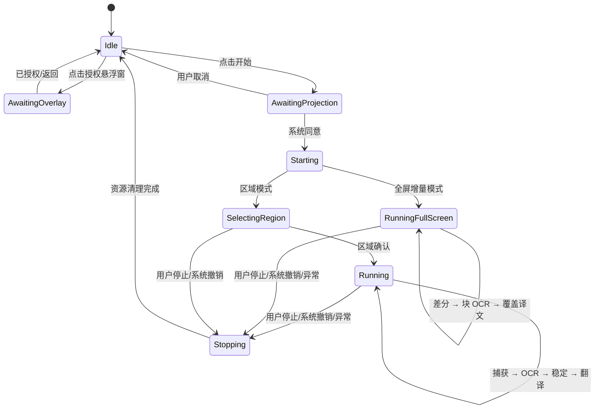

# 架构说明

## 1. 目标与约束

ScreenTranslation 是主入口 Activity、单前台服务的 Android 16 原生应用；Online
edition 额外提供一个非导出的设置 Activity。目标设备为小米 15 Pro（HyperOS 最新稳定版）。设计优先级依次为：

1. 系统授权链正确，用户能随时看见并停止屏幕捕获。
2. 屏幕帧不落盘，OCR 始终在设备端完成；远程文字数据流必须由用户明确配置和确认。
3. 同一时刻最多处理一帧；全屏模式同一时刻最多翻译一个变化文字块，避免积压、发热和结果乱序。
4. 框选区域是默认路径；全屏增量覆盖保持 Experimental，并保留一键回退路径。
5. 所有长生命周期资源在停止、投影撤销或服务销毁时统一释放。

工程固定使用 API 36，因此不包含旧系统兼容分支。

### 1.1 UI 视觉语言边界

`UiStyle` 与 `AppPreferences` 持久化 Apple 风格、MIUIX、Material 3 三选一设置；
`UiStyleController` 在 Activity 创建前应用相应 View 主题，并只对 Material 3 + Monet
组合调用 Material `DynamicColors`。Apple 为主页面、模型管理和 Online BYOK 选择独立
layout family；MIUIX 与 Material 3 继续使用标准 layout family。两组布局保持相同交互
View ID 契约，服务拥有的窗口则读取一次 `OverlayVisualStyle` 快照。详见
[UI_STYLES.md](UI_STYLES.md)。

### 1.2 edition 边界

项目提供三个相互隔离的 edition，共用 MediaProjection、`FramePipeline`、
PP-OCRv6-small 与两套捕获/悬浮层实现：

| Edition | applicationId | versionName | 翻译后端 | 语言范围 |
|---|---|---|---|---|
| Lite | `com.screentranslation.app` | `0.3.1-lite` | Bergamot | 英语直译简体中文；日语经英语级联到简体中文 |
| Full | `com.screentranslation.app.full` | `0.3.1-full` | HY-MT2 1.8B Q4_K_M | 多语言直译简体中文；整个 edition 明确标注 **Experimental** |
| Online | `com.screentranslation.app.online` | `0.3.1-online` | 用户配置的 OpenAI-compatible LLM | 能力由用户选择的模型决定 |

Lite 保留基础包名以承接 v0.1.0 升级，Full/Online 使用 `.full`/`.online` 后缀，
因此三者可在同一设备并存。产品 flavor 同时隔离源码、依赖与 native runtime：
Lite 只携带 Bergamot runner，Full 只携带 HY-MT2 的 llama.cpp JNI，Online 只增加
OkHttp/Okio 且不携带翻译模型；Lite/Full 权重在用户准备模型时按需下载。

ML Kit OCR 与 ML Kit Translate 仅存在于 `benchmark` build type，用于历史基线
对比，不进入 Lite/Full/Online Release APK。

## 2. 模块职责

| 组件 | 职责 | 生命周期/线程约束 |
|---|---|---|
| `MainActivity` | 收集语言、采样间隔和系统授权结果；发送显式 Intent 启停服务 | 只在前台发起 MediaProjection 授权 |
| `ProjectionPermissionActivity` | 从常驻通知在当前目标应用上方请求新的屏幕共享授权 | 独立透明任务；授权完成即退出并回到目标应用 |
| `ScreenTranslationService` | 前台通知、投影会话、虚拟显示、整条流水线的所有权 | 启动后立即进入 FGS；销毁时幂等清理 |
| `OverlayController` | 添加/更新/移除默认区域选择层和可展开译文层 | 所有 WindowManager 操作在主线程 |
| `FullScreenOverlayController` | 把每个译文标签定位到对应 OCR 原文框上方，并提供独立停止条 | 译文层不可触摸；控制条可触摸；WindowManager 操作在主线程 |
| `RegionSelectionView` | 手势框选并将屏幕坐标区域提交给控制器 | 输出规范化、非空且位于可用显示区域内的矩形 |
| `FramePipeline` | 服务依赖的捕获管线生命周期接口 | 两种模式都实现启停、重置、逐帧入口与关闭 |
| `FrameProcessor` | 限速、单飞处理、丢弃过期帧和串联 OCR/翻译 | 不允许并发处理两帧；结果带代次校验 |
| `FullScreenFrameProcessor` | 亮度分块差分、脏块 OCR、文字框稳定与逐块翻译 | `3×6` 分块；强制复核；最多 12 个新块/轮；翻译单活跃 |
| `IncrementalBlockTracker` | 以文字与几何匹配维持 block ID，过滤重复框 | 同一内容连续两次观察后才稳定 |
| `OcrPunctuationRestorer` | 在分句/翻译前恢复高置信句尾、硬换行句界和缺失右侧成对标点 | 先 token 化保护值；纯 Kotlin；规则与阈值固定 |
| `ProtectedTextCodec` | 翻译前替换 URL、邮箱、日期、金额、小数与版本号，翻译后恢复 | 纯 Kotlin；token 避免与输入冲突 |
| `BitmapExtractor` | 从 ImageReader 图像读取 stride，构造 Bitmap 并裁剪 | 每个 `Image` 均在 `finally` 中关闭 |
| `OcrEngine` | 为帧处理层提供统一 OCR 接口；生产实现为 `PpOcrv6Engine` | 单工作线程串行推理；关闭时释放 ORT session 与线程 |
| `StableTextGate` | 文本规范化、去空白抖动、稳定次数门限、重复抑制 | 纯 Kotlin，可单元测试 |
| `TranslationBackend` | 为公共流水线定义模型准备、翻译、取消与关闭接口 | edition 实现使用单工作线程；切换语言对时使旧回调失效 |
| `BergamotTranslationEngine` | Lite 的 en→zh 与 ja→en→zh 路由、模型下载/校验和 Bergamot runner 生命周期 | 仅编入 Lite；模型位于应用私有 no-backup 目录 |
| `HyMt2Q4TranslationEngine` | Full Experimental 的多语言→简体中文提示、GGUF 下载/校验和 llama.cpp 推理 | 仅编入 Full；模型位于应用私有 no-backup 目录 |
| `OnlineLlmTranslationEngine` | 对用户配置的 OpenAI-compatible API 执行可取消 HTTPS 请求 | 仅编入 Online；不持久化原文或译文 |
| `TranslationCoordinator` | Online 整段文本去抖、最小请求间隔、latest-wins、代次校验和内存 LRU | 一个活跃请求与一个最新待处理文本；重置/停止时取消 |
| `OnlineTranslationConfigRepository` | 保存用户服务主机、模型与同意状态；通过 Keystore 读取 API Key | 密钥不写入普通 SharedPreferences、日志或构建产物 |
| `ModelStorageManager` | 按 edition 报告模型状态/大小/固定版本并删除应用模型目录 | 服务运行时禁用删除；校验 canonical path 边界 |
| `AppPreferences` | 保存源/目标语言、捕获模式和采样间隔 | 不保存选择区域、截图、OCR 文本或翻译历史 |
| `VendorAdapter` | 隔离 ROM 私有设置键和设置页候选 Intent | 当前只有 `HyperOsVendorAdapter`；不做其他 ROM 识别或适配 |

## 3. 数据流

```mermaid
flowchart LR
    A["MainActivity：用户配置"] --> B["系统悬浮窗授权"]
    B --> C["系统 MediaProjection 授权"]
    C --> D["ScreenTranslationService：前台服务"]
    D --> E["MediaProjection + VirtualDisplay"]
    E --> F["ImageReader：最新屏幕帧"]
    F --> R{"捕获模式"}
    R -->|"区域（默认）"| G["裁剪/遮蔽区域"]
    G --> H["PP-OCRv6"]
    H --> S["确定性标点恢复 + 保护值隔离"]
    S --> U["源语言过滤 + StableTextGate"]
    U --> I["分句或 Online 整段 latest-wins"]
    I --> J["Edition TranslationBackend"]
    J --> K["OverlayController：原文/译文面板"]
    R -->|"全屏增量（Experimental）"| M["3×6 亮度差分 + 脏块复核"]
    M --> N["PP-OCRv6 文字框"]
    N --> T["确定性标点恢复 + 源语言过滤"]
    T --> V["跨帧稳定"]
    V --> O["单活跃变化块翻译队列"]
    O --> P["FullScreenOverlayController：原文框上方译文"]
    D --> L["运行通知：停止入口"]
    L --> Q["停止后常驻通知：按已保存模式重新授权"]
```



### 3.1 捕获

1. Activity 在可见状态调用 `MediaProjectionManager.createScreenCaptureIntent()`。
2. 用户同意后，Activity 把本次 `resultCode` 和授权 `Intent` 交给显式启动的服务。
3. 服务先创建通知渠道并调用 `startForeground()`，然后取得 `MediaProjection`。
4. 按物理显示尺寸建立 `ImageReader` 与 `VirtualDisplay`。
5. `OnImageAvailableListener` 只获取最新一帧；处理繁忙时直接丢帧，不建立无界队列。

用户从主页面明确选择捕获模式。`REGION` 是持久化默认值；
`FULL_SCREEN_INCREMENTAL` 标注 Experimental，授权后跳过框选，直接建立全屏差分管线。
旋转时区域模式清空原选区并要求重选；全屏模式清空块状态和译文标签后继续使用同一投影
会话与新尺寸。完整算法、覆盖递归边界和回滚条件见
[`FULL_SCREEN_INCREMENTAL_DESIGN.md`](FULL_SCREEN_INCREMENTAL_DESIGN.md)。

Android 14+ 规定一次授权结果只能创建一个投影会话。屏幕旋转、停止后重启或系统撤销投影时，不复用旧令牌；回到 Activity 重新请求。

Android 15 QPR1+ 在锁屏时结束当前投影。服务在
`MediaProjection.Callback.onStop()` 中标记会话失效，幂等释放
`VirtualDisplay`、`ImageReader`、OCR/翻译客户端和悬浮窗，然后发布一条
可自动清除的状态通知。用户解锁并点按通知后回到 `MainActivity`，界面说明
需要重新授权；新的投影只在用户再次接受系统确认页后创建。显式停止走普通
清理路径，不发布这条恢复通知。

### 3.2 OCR 与稳定门

- 区域选择使用屏幕坐标，裁剪前按当前捕获帧尺寸映射并夹紧边界；全屏模式保留
  PP-OCRv6 返回的归一化文字行坐标，用于跨帧跟踪和译文定位。
- Debug/Release 使用 PP-OCRv6 small 检测与识别 ONNX 模型。模型和字符表固定
  到明确上游提交，构建时校验 SHA-256，随 APK/AAB 打包；运行时不下载 OCR 权重。
- `PpOcrv6Engine` 使用 ONNX Runtime Android 1.28.0、CPU execution provider、
  4 个 intra-op 线程、batch 1、检测最长边 640，并关闭 memory pattern 与 CPU arena。
  XNNPACK 在目标 HyperOS 上连续触发原生崩溃，因此生产配置保留已验收的 CPU 路径。
- 权重复制、字符表读取和 ORT session 创建在 OCR 工作线程首次使用时完成，
  前台服务主线程只装配管线，不执行模型文件 I/O。
- Release 的 R8 配置完整保留 `ai.onnxruntime.**`，CI 再从压缩后 APK 检查
  `OnnxTensor.createTensor` 与 `OrtSession.run` JNI 入口，避免仅凭构建成功放行。
- 一个多语言识别模型处理当前开放的中、英、日、韩、法、德、西班牙语画面；
  源语言选择用于后续翻译配置，不再切换 OCR 权重。
- `benchmark` 变体保留 ML Kit Latin/Chinese/Japanese/Korean 基线适配器，迁移
  前后的真机参数、内存与质量数据见
  [`MODEL_BENCHMARK_2026-07-28.md`](MODEL_BENCHMARK_2026-07-28.md)。
- OCR 结果先做首尾空白清理和连续空白归一化。
- `StableTextGate` 只放行达到稳定条件且不同于上次已提交内容的文本；
  即使整体相似度很高，持续两帧的单词或数字变化也会作为新内容提交。
- 若正在处理一帧，新到帧被丢弃；不会让旧画面的翻译覆盖新结果。
- 全屏模式先把整帧缩小到 `1/4` 宽高并计算 `3×6` tile 亮度签名；只 OCR 自然变化
  tile，并在下一次采样强制复核这些 tile。扩大 crop 提供边界上下文，只接受中心落在
  原 tile 的文字框，避免相邻 tile 重复。
- 一轮至少包含 6 个 tile 时合并为一次全帧 OCR；未达到两次一致观察的 block 会继续
  保留所属 tile 的强制复核，避免“第一次漏检、第二次才出现”后永远无法稳定。
- `IncrementalBlockTracker` 以几何重叠/中心距离和文字相似度维持 ID；同一文字连续两次
  观察后才提交翻译。静态画面逐级回退采样间隔，最长 `2000 ms`，一旦变化立即恢复用户值。

### 3.3 翻译

- 公共服务只依赖 `TranslationBackend` 接口，具体实现由 edition source set 提供。
- 所有翻译路径在提交前保护 URL、邮箱、日期、金额和版本号，并在展示前恢复原值；
  缓存键仍使用原始文本，避免占位 token 泄漏到 UI。
- Lite 的固定路由是 `en→zh` 和 `ja→en→zh`。后者依次加载日英、英中两组
  Bergamot 模型并级联推理；其他语对在准备阶段给出明确状态。
- Full 使用 HY-MT2 1.8B Q4_K_M，通过 llama.cpp 把所选源语言直接翻译为简体
  中文。该后端及 Full 应用标签均为 **HY-MT2 Q4 Experimental**。
- Online 使用 `WHOLE_REGION` 输入模式。稳定 OCR 整段经过 600 ms 去抖与 750 ms
  最小请求间隔后形成一次 Chat Completions 请求；协调器保持一个活跃请求和一个
  latest pending，旧 generation 的响应不进入悬浮窗。
- Experimental 全屏模式按稳定的变化文字块调用同一 edition 后端，以单活跃队列保持
  阅读顺序；每轮最多接纳 12 个变化块。Online 因而发送单个稳定文字块而非截图或坐标。
- Online 只接受 HTTPS，拒绝 URL credentials/query/fragment 并关闭重定向。使用
  Bearer 凭据调用同源 `GET /models`，解析 `data[].id` 后从列表选择；Base URL 或
  API Key 改动会使旧列表失效。用户密钥由 Android Keystore AES-256-GCM 加密；
  服务停止、选区重置或息屏时取消活跃请求。
- 两个后端都把模型 URL 固定到明确 revision，并校验预期大小与 SHA-256。
  模型按需下载到 `noBackupFilesDir/models/...`，APK/AAB 只包含对应 native
  runtime，不包含 Bergamot 翻译权重或 HY-MT2 GGUF。
- Lite/Full 模型下载需要 `INTERNET`；校验通过后其 OCR 文本和翻译推理均留在设备端。
  Online 的 OCR 留在设备端，翻译文本发送到用户选定的 API。
- 配置改变或服务结束时关闭旧后端，并通过会话代次丢弃迟到回调。
- ML Kit Translate 的适配器和依赖只供 `benchmark` 基线，不参与三个 production
  edition 的运行时。Online 的完整契约与验收矩阵见
  [`ONLINE_TRANSLATION_DESIGN.md`](ONLINE_TRANSLATION_DESIGN.md)。

### 3.4 悬浮层

使用 `TYPE_APPLICATION_OVERLAY`，前置条件是 `Settings.canDrawOverlays()`：

- **选择层**：可触摸，接收拖拽并绘制区域边框。
- **结果层**：默认不可抢占目标应用输入，展示最新翻译。
- 结果层不设置 `FLAG_SECURE`，使用户发起的系统截图和录屏能够包含译文。
- 结果层把实际屏幕边界回报给服务。目标 HyperOS 会把应用悬浮层混入
  MediaProjection 帧，因此 `BitmapExtractor` 在 OCR 前将该矩形填为空白，
  避免识别结果递归进入下一帧；该遮罩不改变系统截图或录屏产物。
- 两层都由服务所有；停止时统一从 `WindowManager` 移除。

Experimental 全屏模式使用另外两层：

- **译文层**覆盖整个显示区域但不可触摸；每个标签宽度参考 OCR 原文框，测量后优先放在
  原文框上方，顶部空间不足时才放到下方。
- **控制条**位于顶部、可触摸，只承担状态和停止操作，不拦截其余目标应用输入。
- 两层设置 `FLAG_SECURE`，设计目标是让用户看到译文但不让本应用的后续
  MediaProjection 帧再次捕获这些标签，避免 OCR/翻译递归。该行为在目标 HyperOS
  签名 Release 上尚待 Issue #38 验收，因此区域模式继续作为默认与回滚路径。

HyperOS 的“显示在其他应用上层”属于用户可撤销的特殊权限。每次添加窗口前都应重新检查，不把过去的授权状态当成永久状态。

## 4. 权限与系统边界

| 权限 | 原因 | 获取方式 |
|---|---|---|
| `INTERNET` | 下载端侧翻译模型，或发送 Online OCR 文本 | Manifest 普通权限 |
| `ACCESS_NETWORK_STATE` | 给出下载前的网络状态反馈 | Manifest 普通权限 |
| `SYSTEM_ALERT_WINDOW` | 区域选择和译文悬浮层 | 系统特殊权限设置页 |
| `POST_NOTIFICATIONS` | Android 13+ 前台服务通知体验 | 运行时权限 |
| `FOREGROUND_SERVICE` | 启动前台服务 | Manifest 普通权限 |
| `FOREGROUND_SERVICE_MEDIA_PROJECTION` | API 34+ mediaProjection 类型 FGS | Manifest 普通权限 |

服务在 Manifest 中设置：

```xml
android:exported="false"
android:foregroundServiceType="mediaProjection"
```

入口 Activity 是唯一导出组件，且只导出给 `MAIN/LAUNCHER`。应用不声明无障碍、相册、麦克风、位置、联系人或存储权限。

## 5. 状态机



停止操作必须幂等，建议逆序释放：

1. 停止帧调度并使当前回调代次失效；
2. 关闭 PP-OCRv6 的工作线程与 ORT sessions，再关闭翻译客户端；
3. 移除悬浮窗；
4. 释放 `VirtualDisplay` 和 `ImageReader`；
5. 注销回调并停止 `MediaProjection`；
6. 停止前台状态和服务。

## 6. 性能策略

- 采样间隔由用户选择，默认不追求逐帧 OCR；全屏静态画面自适应回退到最长 2 秒。
- 只保留最新帧，OCR 和翻译各自保持单飞。
- 区域模式在 OCR 前裁剪；全屏模式在 OCR 前做低分辨率差分，只识别变化 tile。
- 相同稳定文本不重复翻译。
- PP-OCRv6 sessions 与翻译语言对客户端在整个会话内复用，避免逐帧初始化。
- 长时间运行时以温度、功耗和 UI 流畅度优先；HyperOS 触发热限制时允许降低采样频率。

## 7. 隐私与故障语义

- 不写入截图，不记录 OCR/译文历史，不上传截图。Online 仅在用户确认后发送 OCR 文本。
- 翻译模型按需下载；项目代码不把屏幕图像、OCR 原文或译文发送到项目服务器。
- v0.3.1 Lite/Full/Online Release 不含 ML Kit OCR 或 ML Kit Translate；ML Kit 只在
  `benchmark` 变体中用于基线测量。各 edition 的数据边界见
  [`PRIVACY.md`](../PRIVACY.md)。
- `FLAG_SECURE`、DRM、工作资料策略保护的窗口可能是黑屏或空白，视为系统拒绝捕获，而不是 OCR 故障。
- 投影回调、权限撤销、显示尺寸变化、OCR/翻译失败都应转为可见状态并停止当前会话，避免“通知仍在但实际不工作”。
- 进程被 HyperOS 回收后不自动重建捕获；用户重新打开应用并再次确认系统授权。

## 8. 构建依赖

```text
AGP application / library                9.3.1 / 9.3.0
Gradle Wrapper                           9.6.1
compile / min / target SDK               37 / 36 / 36
Android Build Tools                      37.0.0
APK ABI                                  arm64-v8a
androidx.core:core-ktx                   1.19.0
androidx.activity:activity-ktx           1.13.0
androidx.appcompat:appcompat             1.7.1
com.google.android.material:material     1.14.0
com.microsoft.onnxruntime:android        1.28.0
PP-OCRv6 small det/rec ONNX              pinned + SHA-256 verified
Lite: Bergamot native runner             pinned + SHA-256 verified
Lite: Bergamot en-zh / ja-en / en-zh     runtime download + SHA-256 verified
Full: llama-android / llama.cpp           HY-MT2 Q4 Experimental runtime
Full: HY-MT2-1.8B-Q4_K_M.gguf            runtime download + SHA-256 verified
Online: com.squareup.okhttp3:okhttp       5.4.0
Online: com.squareup.okio:okio            3.17.0 (transitive)
benchmark: com.google.mlkit:translate     17.0.3
benchmark: com.google.mlkit:text-*        16.0.1
```
