# 全屏增量覆盖设计

状态：**Experimental / 尚未完成目标真机验收**

目标平台：Android 16（API 36）、小米 15 Pro、当前项目锁定的 HyperOS 版本
默认与回滚：`REGION` 框选区域模式

## 1. 用户目标

全屏模式持续发现发生变化的屏幕文字，但不对每一帧做完整全屏 OCR。文字达到跨帧
稳定条件后，应用把译文标签直接放到对应原文框的上方；只有顶部空间不足时才放到
原文下方。目标应用除顶部停止条外继续接收触摸。

## 2. 数据流

```mermaid
flowchart LR
    A["MediaProjection 最新帧"] --> B["1/4 尺寸亮度签名"]
    B --> C["3×6 tile 差分"]
    C --> D["自然脏 tile + 上轮强制复核 tile"]
    D --> E["带边缘重叠的 PP-OCRv6"]
    E --> F["按文字框中心归属去除跨 tile 重复"]
    F --> G["文字/几何跨帧跟踪"]
    G --> H["连续两次稳定"]
    H --> I["单活跃变化块翻译队列"]
    I --> J["保护值恢复 + 代次/原文校验"]
    J --> K["原文框上方译文标签"]
```

## 3. 增量检测

- 屏幕固定为 `3×6` 共 18 个 tile，避免为每个像素维护昂贵状态。
- 每帧先缩放到原宽高的 `1/4`，再计算各 tile 的亮度数组。
- 平均亮度差达到 `4`，或至少 `0.8%` 的采样像素亮度差达到 `24`，即标记为自然变化。
- 自然变化 tile 在下一次被强制复核一次。这样同一个新文字至少有两次 OCR 观察，
  同时静态 tile 不持续消耗 OCR。
- 当一次需要处理至少 6 个 tile 时，管线合并为一次全帧 OCR，而不是启动多次独立
  tile 推理；少量变化仍只识别对应 crop。
- OCR crop 在 tile 四周增加至少 16 px 的上下文；只接纳文字框中心落在原 tile 内的
  结果，避免边界文字被截断，也避免相邻 tile 对同一行重复提交。

第一帧会覆盖全部 18 个 tile，下一次会完成全部强制复核；由于达到合并阈值，两次均为
单次全帧 OCR，而不是 36 次 tile OCR。后续成本取决于实际变化区域，这是本模式后续
真机基准必须单独测量的重点。

## 4. 文字块稳定、翻译与过期结果

- `IncrementalBlockTracker` 综合 IoU、中心距离和归一化编辑距离匹配前后两次文字框。
- 完全文字一致且连续观察两次后，block 才进入稳定状态；同一位置文字变化后重新计数。
- 相同文字且 IoU 至少 `0.55` 的重叠框按置信度去重。
- 每轮最多提交 12 个尚无当前译文的稳定变化 block。
- `BlockTranslationQueue` 同时只运行一个翻译调用，按发现顺序处理；屏幕中已经消失的
  block 会从待处理队列移除，正在处理的过期调用会取消。
- 翻译结果发布前同时检查 block ID 和当前原文，防止旧响应覆盖同位置的新字幕。
- URL、邮箱、日期、金额和版本号先由 `ProtectedTextCodec` 替换成碰撞规避 token，
  翻译完成后恢复原值。

Lite/Full 在设备端翻译。Online 只向用户配置的 HTTPS API 发送单个稳定变化文字块，
不发送截图、亮度签名、文字框坐标或设备标识。全屏模式的逐块请求量、429 频率与费用
仍需在签名 Release 验收中记录。

## 5. 自适应采样

用户选择的采样间隔是活跃值。连续静态帧每三次把间隔按 2 倍阶梯增大，最长为
`2000 ms`；任何自然变化都会立即恢复活跃值。`FrameGate` 继续保证只处理最新帧且
最多一帧在途，不建立帧积压队列。

## 6. 覆盖层与递归控制

全屏模式建立两个 `TYPE_APPLICATION_OVERLAY` 窗口：

1. 全屏透明译文层：`FLAG_NOT_TOUCHABLE | FLAG_NOT_FOCUSABLE`，按 OCR 归一化坐标
   创建独立译文标签；宽度至少 96 dp、最多屏宽 72%。
2. 顶部控制条：可触摸但 `FLAG_NOT_FOCUSABLE | FLAG_NOT_TOUCH_MODAL`，仅显示状态和
   “停止”。

两个窗口都设置 `FLAG_SECURE`。设计意图是阻止本应用的 MediaProjection 再次取得译文
标签，从源头切断“译文被 OCR 成新原文”的反馈环；它也意味着用户的系统截图/录屏可能
不会包含这些 Experimental 标签。HyperOS 对 overlay + `FLAG_SECURE` + MediaProjection
的最终结论由 [#38](https://github.com/Arimacose/ScreenTranslation/issues/38) 的
v2.1.0 签名 Release 门禁与不可编辑证据评论确认。

区域模式仍使用既有的精确悬浮层矩形遮蔽，不设置 `FLAG_SECURE`，因此是递归隔离行为
不符合预期时的立即回滚路径。

## 7. 生命周期

- 模型准备、屏幕熄灭或捕获内容不可见时停止接纳新帧，取消/清空块翻译队列与屏上
  标签；恢复可见后强制重新建立全屏签名和两次稳定观察。
- 旋转时复用系统允许的同一投影会话，但清空 tile 签名、block 身份、缓存译文和标签，
  再用新显示尺寸建立状态。
- 停止、投影撤销或服务销毁时关闭队列、OCR/翻译后端、两个悬浮窗、ImageReader、
  VirtualDisplay 与 MediaProjection；关闭操作保持幂等。
- 捕获模式保存在应用设置中；通知快捷启动沿用该模式。用户可在主页面随时选回区域模式。

## 8. 自动化与预验收范围

已纳入普通 JVM 测试的纯逻辑：

- tile 划分、差分与强制复核集合；
- 文字块两次稳定、文字变化重置、ID 连续性与几何映射；
- 自适应采样回退/恢复；
- 翻译队列单活跃、过期取消、暂停/恢复和受保护值恢复；
- 全屏译文层不可触摸、控制条可触摸以及两层 `FLAG_SECURE` 标志。

v2.1.0 预验收已在目标真机完成固定语料和 5 分钟 A/B；最终签名 Artifact 仍执行：

- HyperOS 是否确实从 MediaProjection 中排除安全 overlay；
- 译文标签在刘海、状态栏、导航区、横竖屏和不同字体缩放下的位置；
- 快速滚动、字幕切换和动画背景下的漏检/误触发；
- 区域和全屏各 15 分钟的延迟、内存、温升与持续运行；
- 锁屏、投影撤销、进程回收与通知重启的完整状态机。

任何一项门禁失败时不创建 v2.1.0 tag，区域模式继续保持默认。Plane-first A/B 的方法、
指标与哈希见
[`PP_OCRV6_SUSTAINED_BENCHMARK_2026-08-11.md`](PP_OCRV6_SUSTAINED_BENCHMARK_2026-08-11.md)。
