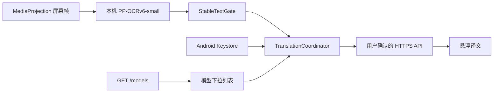

# ScreenTranslation Online 版设计

> 状态：BYOK 单链路已实现；托管 Hy-MT2 provider 已在发布前移除
>
> 目标版本：v0.3.x Online edition
>
> 目标设备：Android 16 / Xiaomi 15 Pro / 最新 HyperOS

## 1. 产品边界

Online edition 使用与 Lite/Full 相同的 MediaProjection、PP-OCRv6-small、稳定文本门控
和悬浮窗，只替换翻译后端。发布包只提供用户自带密钥（BYOK）模式：

1. 用户填写 OpenAI-compatible HTTPS Base URL 和 API Key；
2. 应用调用 `GET /models` 获取该账号可见的模型 ID；
3. 用户从列表选择模型，应用保存主机、模型和数据流同意状态；
4. 稳定 OCR 文本通过 `POST /chat/completions` 翻译。

应用不内置公共 API Key、维护者生产域名或项目托管模型。受硬件和长期运营条件限制，
先前的 Hy-MT2 Q4 托管 provider、网关服务和发布变量均已移除。模型预筛报告仍作为
历史技术证据保留，但不代表当前 APK 功能。

截图和选区坐标始终留在设备上；Online 请求只包含 OCR 文本、语言、所选模型和固定
翻译提示。

## 2. 数据流



Online 网络链路由 `OnlineLlmTranslationEngine`、`OnlineChatClient`、
`OpenAiEndpoint`、`OpenAiChatProtocol` 和 `OnlineTranslationConfigRepository`
组成。公共帧处理层不接触 API Key，也不负责网络重试。

## 3. Edition 与包隔离

`online` flavor：

- `applicationIdSuffix = ".online"`；
- `versionNameSuffix = "-online"`；
- `BuildConfig.ONLINE_LLM = true`；
- 只编入 OkHttp 在线后端，不编入 Bergamot runner 或 llama.cpp JNI；
- PP-OCRv6-small ONNX 资产随 APK/AAB 提供；
- 翻译模型权重不进入 APK/AAB。

CI 和签名 Release 同时检查 Online 的 R8、资源、包名、版本、签名、OCR 资产和后端
隔离。构建过程不再读取 `MANAGED_CLOUD_BASE_URL` 或同类环境变量。

## 4. 用户配置

设置页只显示一套 BYOK 表单：Base URL、API Key 密码框、数据流确认、获取模型、
模型下拉列表、保存、保存并测试和删除密钥。

用户无需手工输入模型名，避免空格、连字符和大小写造成误填。Base URL 或 API Key
输入变化后，旧模型目录立即失效，必须重新获取。主机变化后，旧的数据流同意也立即
失效并要求重新确认。

界面明确提示应用会自动使用 `/models` 和 `/chat/completions`。保存后密码框清空，
只显示“密钥已保存/尚未保存”，不回显明文。

## 5. Endpoint 规范

`OpenAiEndpoint.parse()` 只接受绝对 HTTPS URL、非空 host，且 URL 不含 user-info、
query、fragment、CR 或 LF。Base URL 可带路径前缀，例如 `https://HOST/v1`。

补全规则：

- `https://HOST` → `https://HOST/models` 与 `https://HOST/chat/completions`；
- `https://HOST/v1` → `https://HOST/v1/models` 与
  `https://HOST/v1/chat/completions`；
- 已填写 `/models` 或 `/chat/completions` 时先归一化，避免重复路径。

OkHttp 禁用 HTTP/HTTPS 重定向，防止认证头被带到另一个主机。connect、write、read
和整次 call 超时分别固定为 `15 s`、`30 s`、`75 s` 和 `90 s`；网络失败文本经过
分类和脱敏后才进入 UI。

## 6. 模型目录

用户主动点击“获取可用模型”时发送：

```http
GET BASE_URL/models
Authorization: Bearer API_KEY
Accept: application/json
```

响应只读取 `data[].id`，保留模型 ID 原始字符和顺序，并过滤空值、重复项和过长值。
空列表属于失败，设置页不会保存一个未由当前 Base URL/API Key 获取到的模型。

模型目录请求不含 OCR 文本或截图。模型是否真的支持 Chat Completions、所选语言和
翻译任务，由“保存并测试翻译”做实际验证。

## 7. Chat Completions 契约

常规请求结构：

```json
{
  "model": "SELECTED_MODEL_ID",
  "temperature": 0,
  "messages": [
    {"role": "system", "content": "Translate the user's OCR text from SOURCE to TARGET. Return only the translation."},
    {"role": "user", "content": "OCR_TEXT"}
  ]
}
```

OCR 文本独立放在 user message，不拼接到 system 提示。最大输入为 6,000 字符；响应
正文上限为 1 MiB。成功响应读取 `choices[0].message.content`，兼容普通字符串和
`type=text` part 数组，并拒绝空译文或畸形结构。

官方 `api.deepseek.com` 且模型 ID 以 `deepseek-v4-` 开头时，客户端额外发送：

```json
{"thinking": {"type": "disabled"}}
```

该窄范围规则用于纯翻译低延迟。其他主机即使返回相同模型 ID，也不接收该兼容字段。

## 8. 调度、取消和错误

Online 使用整段翻译，不走 Lite/Full 的分块翻译。协调器约束：

- 稳定文本再等待 600 ms 去抖；
- 两次请求起点至少间隔 750 ms；
- 同时最多一个活跃请求；
- 活跃期间只保留一个最新 pending 文本；
- 新选区、停止服务、息屏、后端关闭时取消请求；
- 回调携带代次，旧结果不得覆盖新选区。

401/403 归为认证，404 归为 Endpoint/模型路径，429 归为限流，5xx 归为服务端，
超时、DNS 和连接问题归为网络。仅对明确的瞬时失败做一次有抖动的有限重试；取消、
DNS、TLS 和 `SocketTimeoutException` 不重试。生成请求超时后服务端可能已经完成
计费，禁止自动重试同时避免重复用量和两轮连续等待。错误信息不包含 URL 凭据、
Authorization、OCR 原文或响应正文。

## 9. API Key 存储

API Key 使用 Android Keystore 生成的 AES-256-GCM 密钥加密。普通
SharedPreferences 只保存密文、IV 和版本；Base URL、模型 ID、同意版本与主机身份
单独保存。

- 密钥不进入源码、BuildConfig、Gradle 参数、GitHub Actions artifact 或日志；
- `ReadyOnlineTranslationConfig` 不是 data class，不生成可能泄密的 `toString/copy`；
- 更换主机要求重新同意；
- 删除操作同时移除密文和 Keystore alias；
- 网络客户端关闭和连接池回收在后台 daemon executor 执行，避免 Android 16 主线程
  socket 清理异常。

## 10. 框选与快捷启动

共享框选交互适用于三种 edition：

- 最小边长由 64dp 降为 32dp，适配小字幕和短句；
- 移除覆盖全屏的黑色遮罩，只在选区内部使用轻微蓝色填充；
- 使用白色外框、蓝色内框、双色角点和顶部说明胶囊保持可见性；
- 框选期间窗口取得焦点，并同时注册预测返回高优先级回调、传统 Back key 拦截和
  `systemGestureExclusionRects`，避免边缘拖动触发目标应用返回；
- 框选结束后恢复不可聚焦的小悬浮面板，使目标应用继续接收输入。

停止识屏后，通知栏保留一条 ongoing 快捷通知。点击“开始识屏”会打开独立透明任务，
在当前目标应用上方请求新的 MediaProjection 授权；授权后直接启动服务并回到目标
应用框选。运行期间快捷通知由前台服务通知替代，停止或系统撤销投影后再恢复。

## 11. HyperOS 省电状态

Android 的 `isBackgroundRestricted` 和 AOSP 电源白名单不足以判断 HyperOS 的
“无限制”。目标 ROM 的实机差分确认 `Settings.System.MILLET_NO_RESTRICT_APP`
保存逗号分隔的精确包名：

- 包名精确命中：显示“已识别为无限制”；
- 设置键存在但未命中：显示“当前未设为无限制”；
- 设置键不存在：回退到 AOSP/厂商状态未确认；
- Android 明确标记 background restricted 时始终优先显示受限。

入口按钮始终可用，便于用户复查或调整 HyperOS 省电策略。

## 12. 日志与隐私

应用不安装 HTTP body logger，不记录 Authorization、API Key、OCR 原文、译文或响应
正文。服务方仍能看到请求文本、来源 IP、时间和账户信息，其日志、保留、训练和跨境
政策由用户选择的服务决定。首次使用和主机变化后的显式确认是发送数据的前提。

完整说明见 [`../PRIVACY.md`](../PRIVACY.md)。

## 13. 关键文件

共享：

- `app/src/main/java/com/screentranslation/app/ProjectionPermissionActivity.kt`
- `app/src/main/java/com/screentranslation/app/service/CaptureShortcutNotification.kt`
- `app/src/main/java/com/screentranslation/app/service/ScreenTranslationService.kt`
- `app/src/main/java/com/screentranslation/app/overlay/OverlayController.kt`
- `app/src/main/java/com/screentranslation/app/overlay/RegionSelectionView.kt`

Online source set：

- `app/src/online/java/com/screentranslation/app/ml/OnlineLlmTranslationEngine.kt`
- `app/src/online/java/com/screentranslation/app/online/OnlineChatClient.kt`
- `app/src/online/java/com/screentranslation/app/online/OpenAiEndpoint.kt`
- `app/src/online/java/com/screentranslation/app/online/OpenAiChatProtocol.kt`
- `app/src/online/java/com/screentranslation/app/online/OnlineTranslationConfigRepository.kt`
- `app/src/online/java/com/screentranslation/app/online/AndroidKeystoreSecretCipher.kt`
- `app/src/online/java/com/screentranslation/app/online/OnlineSettingsActivity.kt`

## 14. 发布验收门槛

1. 全部 edition JVM 单测通过，Online 协议、Endpoint、手势窗口和省电状态新增回归
   测试通过；
2. `lintOnlineRelease`、R8 `assembleOnlineRelease` 和 AAB 构建通过；
3. APK 包名、版本、targetSdk 36、PP-OCRv6 资产、OkHttp 与后端隔离符合清单；
4. APK 只出现用户 API UI/文案，不含 `ManagedCloudService`、托管 URL BuildConfig、
   网关服务或维护者密钥；
5. 签名 Release 的证书 SHA-256 与既有公开版本一致；
6. Xiaomi 15 Pro 真机覆盖安装后，Base URL、模型和 Keystore 状态保持；
7. 真机完成 `/models`、设置页翻译和
   `MediaProjection -> PP-OCRv6 -> API -> 悬浮译文`；
8. 32dp 小框可接受，无整屏黑幕，左右边缘拖动不触发目标应用返回；
9. 停止后常驻通知存在，从目标应用点击可重新授权并直接进入框选；
10. HyperOS “无限制/未设为无限制”在设置页切换后能实时更新；
11. 停止、拒绝授权、锁屏、旋转和重复启动不产生崩溃、残留投影或悬浮窗；
12. logcat、应用私有目录和发布产物不出现测试 API Key 明文。

历史 Debug BYOK/DeepSeek 单次闭环已通过。当前改动在签名发布前按上述完整矩阵重新
验收，结果追加到 [`DEVICE_TEST.md`](DEVICE_TEST.md)。
