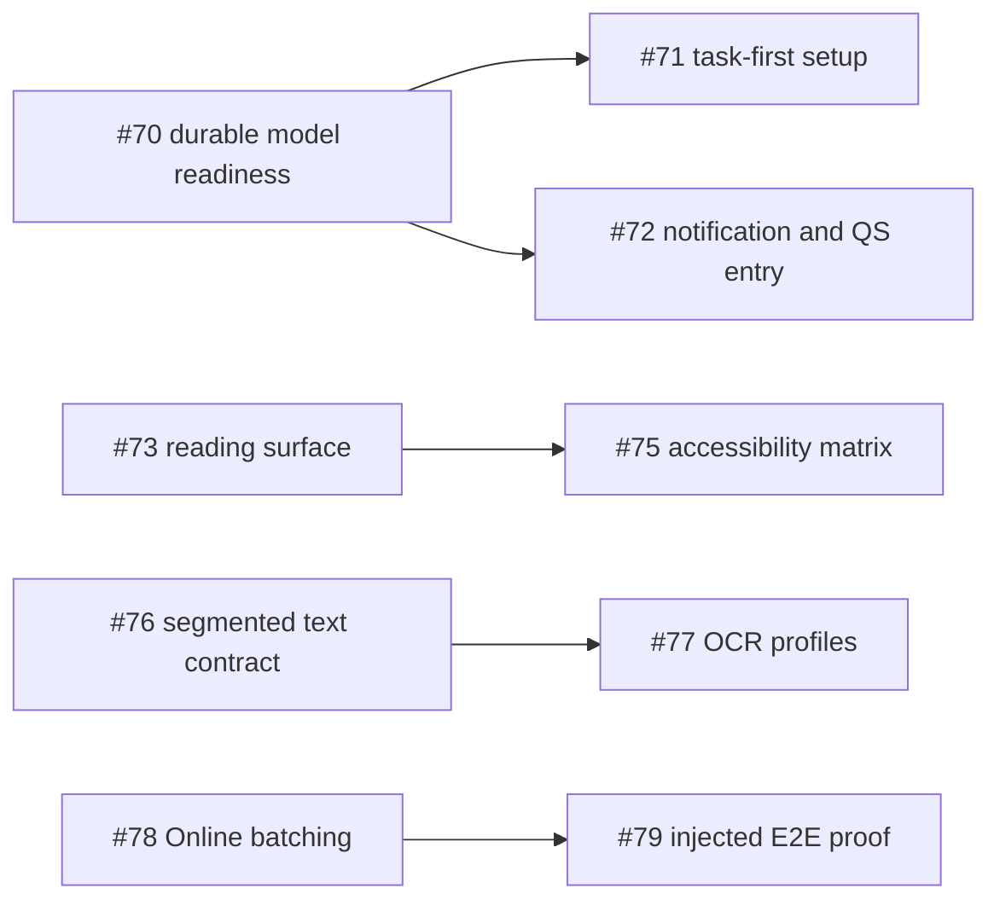

# 产品体验审计与路线图

最后核验：2026-08-13 
审计基线：`main@0daeafcb47a914854de7e004121686a1f00a1b22` 
跨版本总控：[Issue #80](https://github.com/Arimacose/ScreenTranslation/issues/80)

本文把一次从仓库源码、三 edition、GitHub 发布状态、自动化门禁和小米 15 Pro
签名真机证据出发的体验审计，转成可逐项关闭的版本计划。它表达执行顺序和验收边界，
不承诺发布日期。

## 结论

ScreenTranslation 当前的核心风险已经不是“捕获、OCR 或翻译链路是否能运行”，而是
已有能力是否以普通用户容易理解、可中断恢复、可完整阅读的方式出现。

已验证的工程基础包括：

- Android 16 `MediaProjection`、前台服务、区域框选与全屏增量识别；
- PP-OCRv6、块级差分、稳定门、single-flight 与 source-match 发布；
- Lite、Full、Online 三 edition 的包名、依赖和 native runtime 隔离；
- 固定模型 revision/SHA-256、Android Keystore BYOK、隐私与 Release provenance；
- 小米 15 Pro / Android 16 / HyperOS 的签名 Release 耐久与生命周期验收；
- 审计时 Lite 237、Full 233、Online 251，共 721 条 JVM 测试全部通过，三套
  Release lint 均为 0 error。

下一阶段的产品目标是：

> 从“功能齐全、需要理解项目结构”推进到“首次打开就知道下一步，长任务可恢复，
> 任何稳定译文都可发现，失败信息对普通用户有意义”。

## 优先级定义

- **P0**：直接阻碍首次使用或导致稳定结果不可发现，优先建立基础状态模型；
- **P1**：显著影响日常效率、可读性、质量、可访问性或错误恢复；
- **P2**：发布可发现性、贡献者体验或合规配套，可与主线并行但不阻塞 P0。

## 审计发现

### 1. 模型准备仍由 Activity 承载

[`MainActivity.kt`](../app/src/main/java/com/screentranslation/app/MainActivity.kt)
直接持有准备引擎，界面销毁时关闭它；主题切换会触发 `recreate()`。现有 `.part`
断点续传能保护字节，但缺少独立、可观察的下载任务、暂停/取消、速度/ETA、存储与
网络预检。快捷启动还没有在请求投影授权前统一检查 Lite/Full 模型 readiness。

**决策：** 先实施 [#70](https://github.com/Arimacose/ScreenTranslation/issues/70)，
再让主页 [#71](https://github.com/Arimacose/ScreenTranslation/issues/71) 和快捷入口
[#72](https://github.com/Arimacose/ScreenTranslation/issues/72) 消费同一状态源。

### 2. 全屏稳定译文可能被截断或缺少可发现入口

[`FullScreenOverlayController.kt`](../app/src/main/java/com/screentranslation/app/overlay/FullScreenOverlayController.kt)
把标签限制为三行并使用尾部省略；
[`IncrementalScreenLogic.kt`](../app/src/main/java/com/screentranslation/app/capture/IncrementalScreenLogic.kt)
在密集区域没有合法位置时返回空结果。当前策略避免叠放，但用户看不到完整译文，也
看不到“还有多少条未放置”。

**决策：** [#73](https://github.com/Arimacose/ScreenTranslation/issues/73)
建立阅读模式、暂停/继续、显示/隐藏、字号/透明度和无静默遗漏合同；
[#75](https://github.com/Arimacose/ScreenTranslation/issues/75) 在该稳定阅读面上补齐
TalkBack 与渲染矩阵。

### 3. 首页信息顺序偏向设置而非任务

主页目前先展示外观，再依次展示翻译、模型、权限和启动。新用户需要自行推断正确顺序。

**决策：** [#71](https://github.com/Arimacose/ScreenTranslation/issues/71)
把源语言、目标语言、捕获模式、readiness 摘要和一个主操作放到首屏；Apple、MIUIX、
Material 3 与 Monet 继续作为同一交互模型之上的视觉系统。

### 4. 整行级目标文字过滤会损失混排内容

[`SourceTextFilter.kt`](../app/src/main/java/com/screentranslation/app/util/SourceTextFilter.kt)
以整行判断是否包含目标语言文字。它避免了中文被反复翻译，但也可能跳过
`设置 Settings (v2.1.0)` 中可翻译的英文片段，以及只有汉字、没有假名的日语 UI。

**决策：** [#76](https://github.com/Arimacose/ScreenTranslation/issues/76)
建立脚本分段、智能混排/严格跳过/显式源语言三档策略和纯汉字日语合同；现有 URL、
版本、金额、日期等 protected span 继续逐字节恢复。

### 5. 固定 OCR 参数无法同时覆盖小字幕和密集文档

现有 PP-OCRv6 参数优先保障持续识别的延迟与功耗。小字幕、细字和文档页面需要不同的
分辨率与阈值，但全局提高每一帧成本会破坏当前耐久优势。

**决策：** [#77](https://github.com/Arimacose/ScreenTranslation/issues/77)
增加 Balanced、小字幕、文档三个有界 profile，并只对稳定 ROI 或脏 tile 触发小字二次
识别。

### 6. Online BYOK 仍有开发者工具痕迹

自动 `GET /models` 并选择精确模型 ID 的方向保持不变；主要缺口是大列表搜索、可取消
操作、请求耗时/usage、普通错误与技术详情分层，以及全屏一块一请求造成的限流压力。

**决策：** [#78](https://github.com/Arimacose/ScreenTranslation/issues/78)
增加可搜索模型列表、最终 URL、取消、指标和带严格 block ID 的有界批处理。自由输入
模型名不作为主路径。

### 7. 自动化尚未执行完整产品旅程

现有 instrumentation 能验证启动、生命周期状态机和磁盘隐私，但没有在 CI 中完整执行
“捕获 → OCR → 翻译 → Overlay → 复制 → 停止”。真实 `MediaProjection` 和 HyperOS
行为已有签名真机门禁，纯产品旅程仍可通过注入固定帧实现确定性自动化。

**决策：** [#79](https://github.com/Arimacose/ScreenTranslation/issues/79)
建立 injectable capture/OCR/translation/overlay 边界、三 edition E2E、Online
MockWebServer、golden 与 macrobenchmark。

### 8. 发布材料对普通用户的入口偏后

README 的首次使用说明位于大量架构与构建内容之后，Release 同时提供 APK、AAB、
许可证和校验文件；当前预览是确定性生成的 UI 动画，并非真机录像。

**决策：** [#69](https://github.com/Arimacose/ScreenTranslation/issues/69)
增加“我该安装哪个 APK”、APK/AAB 区别、靠前的五步使用说明和带设备/ROM/版本的
真实 30 秒演示。

## 分版本计划

### [v2.1.1](https://github.com/Arimacose/ScreenTranslation/milestone/4) — 低风险修补

- [#68](https://github.com/Arimacose/ScreenTranslation/issues/68)：48dp 命中区域、
  用户错误映射和 UI 细节；
- [#69](https://github.com/Arimacose/ScreenTranslation/issues/69)：Release/README
  可发现性与真实真机演示；
- [PR #58](https://github.com/Arimacose/ScreenTranslation/pull/58)、
  [#59](https://github.com/Arimacose/ScreenTranslation/pull/59)、
  [#60](https://github.com/Arimacose/ScreenTranslation/pull/60)：逐个更新到当前 `main`，
  分别验收后合并，避免同时改变 Wrapper 和 Actions。

### [v2.2.0](https://github.com/Arimacose/ScreenTranslation/milestone/3) — 首次使用与模型准备

- [#70](https://github.com/Arimacose/ScreenTranslation/issues/70)：前台、可恢复的模型准备；
- [#71](https://github.com/Arimacose/ScreenTranslation/issues/71)：任务优先首页与首次使用；
- [#72](https://github.com/Arimacose/ScreenTranslation/issues/72)：可配置通知快捷入口与
  Quick Settings tile；
- [#45](https://github.com/Arimacose/ScreenTranslation/issues/45)：应用内 About、许可、
  隐私和数据流；
- [#43](https://github.com/Arimacose/ScreenTranslation/issues/43) 与
  [#44](https://github.com/Arimacose/ScreenTranslation/issues/44)：x86_64 贡献者路径与
  每 edition SBOM，作为配套工作保留。

### [v2.3.0](https://github.com/Arimacose/ScreenTranslation/milestone/5) — 悬浮阅读体验

- [#73](https://github.com/Arimacose/ScreenTranslation/issues/73)：全屏阅读控制与无静默遗漏；
- [#74](https://github.com/Arimacose/ScreenTranslation/issues/74)：可拖动/冻结的区域结果面板
  与归一化预设；
- [#75](https://github.com/Arimacose/ScreenTranslation/issues/75)：三套 UI 的可访问性和
  渲染验收矩阵。

### [v2.4.0](https://github.com/Arimacose/ScreenTranslation/milestone/6) — 质量与效率

- [#76](https://github.com/Arimacose/ScreenTranslation/issues/76)：混合脚本分段与纯汉字日语；
- [#77](https://github.com/Arimacose/ScreenTranslation/issues/77)：小字幕/文档 OCR profile；
- [#78](https://github.com/Arimacose/ScreenTranslation/issues/78)：Online BYOK 搜索、取消、
  指标和 block batching；
- [#79](https://github.com/Arimacose/ScreenTranslation/issues/79)：注入式完整旅程、golden
  与 macrobenchmark。

## 依赖顺序

同一版本内也按上述依赖逐项验收，不把多个基础状态机混入一个大型 PR。

## 跨版本完成定义

### 构建与隔离

- Lite、Full、Online 单元测试、Release lint、R8、APK/AAB 构建通过；
- 反射 backend、native runtime、模型资产与第三方 notices 保持 edition 隔离；
- `git diff --check`、依赖审查与 CodeQL 通过。

### 隐私与安全

- 不持久化截图、OCR 历史或译文历史；
- API Key 不出现在日志、截图、报告、备份或异常详情；
- Online 只向用户选定的 HTTPS host 发送待翻译文字；
- `FLAG_SECURE`、投影授权与前台服务停止边界保持。

### UI 与可访问性

- Apple、MIUIX、Material 3、Monet；
- 浅色/深色、竖屏/横屏；
- font scale 1.0、1.3、2.0；
- TalkBack 主路径；
- 交互命中区域至少 48dp；
- 动态标签不持续抢占可访问性焦点。

### 捕获与性能

- 区域与全屏发布继续满足原文/译文原子性和 source-match；
- 停止后释放 projection、virtual display、image reader、overlay、OCR 和翻译资源；
- 任何捕获、模型、通知或悬浮层改动都需要小米 15 Pro / Android 16 / HyperOS
  签名 Release 复验；
- 性能证据记录 source SHA、APK SHA、fixture SHA、设备/ROM、阈值与原始结果。

## 明确边界

- 当前路线图不扩大其他 ROM 支持；
- 不以无障碍服务替代 `MediaProjection` 授权；
- 不以 Compose 重写作为体验改进前置条件；
- 常驻通知默认保留，用户开关和 Quick Settings tile 是增量能力；
- 不按前台应用包名自动保存区域，避免引入额外应用识别权限；
- 新的中间档翻译模型只有在既有 provider admission 证据满足后才进入产品选择器；
- 当前 Full 继续标记 Experimental。

## 维护规则

1. 每项实现使用独立分支和 Draft PR；
2. PR body 必须链接对应 Issue，并逐条映射 Acceptance；
3. 只有代码、文档、自动化和适用的签名真机证据全部完成后才关闭 Issue；
4. 外部依赖或硬件证据缺失时保持 fail-closed 状态并记录剩余条件；
5. 总控 [#80](https://github.com/Arimacose/ScreenTranslation/issues/80) 只跟踪顺序，
   不替代每项 Issue 的验收合同。
