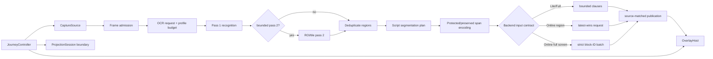

# v2.4.0 设计：混合文字、小字 OCR、Online 批处理与可注入 E2E

状态：**设计冻结 / 功能实现与签名真机验收待后续提交**

基线：`origin/main@b7bf04a9429908bac9a41e8b804919d33cfc4012`

范围：[#76](https://github.com/Arimacose/ScreenTranslation/issues/76)、
[#77](https://github.com/Arimacose/ScreenTranslation/issues/77)、
[#78](https://github.com/Arimacose/ScreenTranslation/issues/78)、
[#79](https://github.com/Arimacose/ScreenTranslation/issues/79)

## 1. 目标与固定边界

v2.4.0 在不改变三 edition、MediaProjection 用户授权和隐私边界的前提下，完成四件事：

1. 从 whole-line 跳过升级为 script-aware、protected-span-aware 的确定性翻译计划；
2. 为 PP-OCRv6 提供有上限的 Balanced、Small subtitle、Document profile 和二次识别；
3. 为 Online BYOK 提供可搜索模型、取消、无内容指标和严格 block-ID 批处理；
4. 用注入式 capture journey 在 CI 自动证明 start→OCR→translate→publish→copy→stop，
   同时继续把真实 MediaProjection 与 HyperOS 行为留在签名真机门禁。

固定边界：

- 不引入 Compose 重写，不改变 Apple/MIUIX/Material/Monet 的现有 View 合同；
- 不引入新翻译模型，不扩大 ROM 承诺；
- 不保存截图、OCR、译文、前台应用 identity 或请求正文指标；
- Region 保持默认，Full-screen incremental 保持 Experimental；
- Lite、Full、Online 必须消费同一个 segmentation/OCR request/batch publication 合同；
- Debug、JVM、模拟器和 injected fixture 结果不替代最终签名真机结论。

## 2. 总体架构



共享状态只保存配置、代次、几何、统计计数和稳定 ID；bitmap、OCR text、译文、API Key 与
响应正文均保持进程内短生命周期，不进入 SharedPreferences、文件、指标或测试报告。

## 3. #76：Script-aware segmentation

### 3.1 类型合同

新增纯 Kotlin 合同：

```kotlin
enum class SourceRoutingPolicy {
    SMART_MIXED,
    STRICT_TARGET_SKIP,
    EXPLICIT_SOURCE,
}

enum class TextSpanKind {
    TRANSLATE,
    PRESERVE_TARGET,
    PRESERVE_PROTECTED,
    SEPARATOR,
}

data class PlannedTextSpan(
    val id: Int,
    val kind: TextSpanKind,
    val start: Int,
    val endExclusive: Int,
    val text: String,
)

interface SegmentedTextPlan {
    val originalText: String
    val requestText: String
    val translatedSpanCount: Int
    fun restore(translatedRequestText: String): String
}
```

`requestText` 只包含 eligible source spans 和确定性 STP token。目标语言 span、URL、邮箱、
金额、日期、版本、identifier、filename 等都编码为不可翻译 token；`restore` 必须验证 token
集合无缺失、无重复、无意外 token，再按原顺序恢复。

### 3.2 单次线性扫描

执行顺序固定为：

1. 以现有 `ProtectedTextCodec` 规则识别强保护 span；新增时间、路径/文件名、稳定 identifier
   规则时必须有独立 case ID；
2. 对剩余 Unicode code point 归类 Latin、Han、Hiragana、Katakana、Hangul、Cyrillic、
   digit、punctuation/space；
3. 合并相邻同类 run；空白和标点附着到最近的语义 span，不独立触发翻译；
4. 根据 source/target/policy 标记 TRANSLATE 或 PRESERVE_TARGET；
5. 生成唯一 token family，保持原 span 顺序和边界；
6. 对 `MAX_INPUT_CODE_POINTS` 以上输入直接走有上限的逐段 chunk，不执行回溯或二次全串扫描。

复杂度要求：时间 O(n)、额外 span 内存 O(min(n, `MAX_SPANS`))，禁止灾难性正则回溯。

### 3.3 Mixed 和纯汉字日文策略

`SMART_MIXED`：

- `en→zh` 中，Han run 作为已是目标语言保留，Latin run 进入翻译；
- `ja→zh` 中，Kana 与相邻 Han 共同进入翻译；
- 纯 Han 日文只在以下任一信号满足时进入翻译：
  - 同一 OCR block/相邻稳定 block 含 Kana；
  - 用户显式选择 `EXPLICIT_SOURCE`；
  - 命中版本化且有大小上限的 UI lexicon，例如 `設定`、`確認`、`開始`、`終了`；
- 未命中信号的纯 Han 使用 PRESERVE_TARGET，避免把中文 UI 反复送入日中翻译。

`STRICT_TARGET_SKIP` 保留旧保守行为：出现明确 target script 时整块跳过。该模式是用户可选
回滚策略，不作为默认。

### 3.4 Pipeline 接入

- Region：每个 OCR block 先生成 `SegmentedTextPlan`，稳定门使用 normalized original；
  translation cache key 使用 backend identity + requestText；发布前 `restore`；
- Online whole-region：计划列表合并为一个带 block separator 的 request，latest-wins 仍以
  generation 和完整 request identity 判定；
- Full-screen：`TrackedScreenTextBlock` 同时保存 original、request identity 和 plan；只有同一
  block ID 且 source/request identity 未变化的响应可以发布；
- 任何 token 校验失败都进入受控错误，不发布部分恢复结果。

### 3.5 自动化门禁

- `设置 Settings (v2.1.0)`：保留 `设置` 和版本，只翻译 `Settings`；
- 中日混合、游戏菜单、纯汉字 lexicon、相邻 Kana context；
- URL、email、amount、date、identifier、filename case IDs 零回归；
- malformed surrogate、组合字符、RTL 标点、65,536+ code point 对抗输入；
- 三 edition 对同一 plan fixture 产生相同 request/reconstruction contract；
- en→zh、ja→zh regression report 写入 fixture SHA、case IDs 和结果，不写私有 OCR 数据。

## 4. #77：OCR profiles 与有上限二次识别

### 4.1 类型合同

```kotlin
enum class OcrProfileId { BALANCED, SMALL_SUBTITLE, DOCUMENT }

data class OcrProfile(
    val id: OcrProfileId,
    val detectionLongSide: Int,
    val recognitionThreshold: Float,
    val minimumBoxHeightPxAtReference: Int,
    val stabilityObservations: Int,
    val debounceMillis: Long,
    val secondPass: SecondPassBudget?,
)

data class SecondPassBudget(
    val maxTiles: Int,
    val maxPixels: Long,
    val timeoutMillis: Long,
    val upscaleFactor: Float,
)

data class OcrRequest(
    val profile: OcrProfile,
    val passIndex: Int,
    val roiIdentity: String?,
)
```

`OcrEngine.recognize` 接收 `OcrRequest`；默认参数映射到 BALANCED，保持现有调用和已验收
640-long-side CPU path。profile 只调整输入缩放、阈值、稳定/debounce 和二次 pass 预算，禁止
在 UI 层直接散落常量。

### 4.2 建议冻结值与校准规则

设计初值：

| Profile | Long side | Score | 二次 pass | 使用场景 |
|---|---:|---:|---|---|
| Balanced | 640 | 0.25 | 关闭 | 默认连续识别与回滚 |
| Small subtitle | 960 | 0.22 | 最多 2 tiles / 1.5 MP / 900 ms / 1.5x | 底部字幕、细字 UI |
| Document | 1280 | 0.25 | 最多 4 tiles / 3 MP / 1400 ms / 1.25x | 静态文档与密集页面 |

这些是实现起点，不是公开性能声明；固定 fixture 校准和签名真机热/内存结果可收紧，任何放宽
必须更新 machine-readable threshold 与报告。

### 4.3 二次 pass 触发与去重

仅在稳定 ROI 或当前 dirty tiles 满足下列条件时触发：

- first pass 无结果但 luminance/text-likelihood 足够；或
- box 高度低于 profile 阈值且置信度位于可恢复区间；或
- 已有稳定 block 在几何位置仍存在但本轮消失。

触发前同时检查 tile 数、总像素、deadline 和 pipeline generation。二次结果与 first pass 以
normalized IoU、中心距离和 normalized text 比较；同一区域只保留置信度更高且文本更完整的
一个 block。跨 pass 的 duplicate suppression 先于稳定门和翻译队列。

### 4.4 持久化与指标

- profile 按 `CaptureMode.REGION` / `FULL_SCREEN_INCREMENTAL` 分别保存；
- 不按前台应用、包名或截图内容保存；
- 指标只含 profile、pass、latency、input pixels、materialized bytes、block counts、dedupe
  counts、timeout/cancel count、thermal status；
- 指标不含 bitmap、文本、坐标细节、应用 identity 或文件路径。

### 4.5 自动化与真机分界

JVM/fixture：recall、duplicate suppression、预算、timeout、generation cancellation、静态屏幕
adaptive downsampling。签名真机：每 profile 区域/全屏 15 分钟、PSS/RSS/VmHWM、CPU、thermal、
电池、OCR latency、recall 与 source-matched publication。

## 5. #78：Online BYOK 模型、取消、指标与 block batch

### 5.1 模型目录

`OnlineModelCatalogClient` 返回 `OnlineModelDescriptor(id, displayName?, owner?, createdAt?)`；`id`
始终是保存和请求值，friendly metadata 只供展示。搜索采用本地 lowercase token index，保留精确
ID，最多 1,000 模型、单 ID 最多现有合同长度。

设置页始终显示规范化后的最终：

- `GET <origin/path>/models`
- `POST <origin/path>/chat/completions`

Base URL、API Key 或 consent host 改变时立即取消目录/测试请求并使旧 catalog 失效。

### 5.2 Operation state 与错误合同

目录拉取和测试各自使用：`IDLE → RUNNING → SUCCEEDED | FAILED | CANCELLED`。取消按钮直接调用
`TranslationCall.cancel()`，generation 使迟到回调失效，保存配置只在完整验证事务成功后提交。

新增 `UserFacingFailure(category, summaryRes, retryable, technicalCode, redactedDetail)`；稳定分类覆盖
401/403/404/408/429/5xx、DNS、TLS、timeout、cancel、response/schema。`redactedDetail` 先移除
Authorization、API Key、query、OCR text、response body，再允许在显式详情区展示。

### 5.3 无内容指标

```kotlin
data class OnlineRequestMetrics(
    val requestId: Long,
    val modelId: String,
    val statusCode: Int?,
    val latencyMillis: Long,
    val inputCharacters: Int,
    val outputCharacters: Int,
    val promptTokens: Long?,
    val completionTokens: Long?,
    val attemptCount: Int,
    val outcome: Outcome,
)
```

只保存最近会话内聚合计数；停止/进程退出后丢弃。指标中不含请求/响应正文、API Key、完整 URL
query、OCR block 文本或坐标。

### 5.4 严格 block-ID batch protocol

请求中的每个稳定 block 使用本地 session-scoped opaque ID：

```json
{"blocks":[{"id":"b17-g4","text":"..."}]}
```

响应只接受：

```json
{"blocks":[{"id":"b17-g4","translation":"..."}]}
```

解析器必须拒绝：缺失、重复、意外、空、超长、非字符串 ID/translation，以及数量不一致。批次
上限同时约束 block 数、输入字符和估算 token；默认最多 8 blocks / 6,000 characters。失败策略：

1. 401/403/schema/token 错误不拆分；
2. 408/429/5xx 先遵循有上限 retry/backoff；
3. 仍失败且 batch size > 1 时二分，最大 split depth 3；
4. 每个 block publication key 包含 block ID + source identity + generation；
5. 已成功的 block 不重发、不重复发布，迟到响应全部丢弃。

Region 继续 whole-region latest-wins，不强制使用 block batch；Full-screen Online 使用 batch coordinator。

## 6. #79：Injected capture E2E 与 Macrobenchmark

### 6.1 可注入边界

在不泄漏 Android framework 对象的 shared journey 层定义：

```kotlin
interface CaptureSource : AutoCloseable { fun start(onFrame: (CapturedFrame) -> Unit) }
interface ProjectionSession : AutoCloseable { val state: State }
interface OverlayHost : AutoCloseable { fun publish(model: OverlayModel); fun clear() }
interface ClipboardSink { fun copy(label: CopyLabel, text: String) }
interface JourneyTelemetrySink { fun record(event: JourneyEvent) }
```

production adapter 继续拥有 MediaProjection/ImageReader/WindowManager；test adapter 从固定 fixture
提供 frame、fake session、recording overlay 和 memory-only clipboard。`JourneyController.stop()` 必须
幂等关闭 capture、projection、pipeline、OCR、translation、overlay，并清空 pending/caches。

### 6.2 E2E 旅程

CI 分 edition 执行：

1. start；
2. region select 或 full-screen scan；
3. English/Japanese/mixed fixture OCR；
4. segmentation/protected span；
5. Lite/Full fake backend 或 Online MockWebServer；
6. 原文/译文原子发布；
7. copy original / translation；
8. pause/resume/hide/reading；
9. stop；
10. 断言所有 adapter closed、无 pending call、无 screenshot/OCR history 文件。

Online fixtures覆盖 models、success、401、429、timeout、cancel、malformed/duplicate/unexpected block ID。

### 6.3 Macrobenchmark 与阈值

新增独立 benchmark module 或等价隔离 variant，报告 JSON：source SHA、fixture SHA、variant、
machine image、startup median/p95、frame processing median/p95、jank、allocated bytes、PSS proxy 和
threshold version。CI job 命名为 `Injected capture E2E and host macrobenchmarks`，避免把 injected
coverage写成真实 MediaProjection 设备测试。

阈值采用 baseline + 明确绝对 ceiling；环境噪声项只报告趋势，确定性合同失败直接阻断。

### 6.4 真机仍负责的事实

- 系统 MediaProjection consent 与 one-token/one-session；
- HyperOS overlay、通知、Tile、锁屏、旋转、Home、任务移除和进程回收；
- ARM64 ORT/Bergamot/HY-MT2 runtime、真实 BYOK HTTPS；
- 15 分钟 memory/thermal/battery、视觉、TalkBack、最终签名与 exact-byte promotion。

## 7. 实现顺序与提交边界

1. **Contract commit**：segmentation types、strict restoration、fixtures；
2. **Pipeline commit**：Region/Full-screen 三 edition 接入 #76；
3. **OCR profile commit**：typed request、preferences、bounded second pass、dedupe/telemetry；
4. **Online contract commit**：catalog metadata/search、operation state、error mapper、metrics；
5. **Online batch commit**：strict protocol、coordinator、split/publication tests；
6. **Injected journey commit**：production adapters、fake adapters、edition E2E、privacy checks；
7. **Benchmark/docs commit**：threshold JSON、CI job、reports、README/architecture；
8. **Candidate commit**：versionCode 10 / versionName 2.4.0、changelog、release/device matrix；
9. 自动化全绿后把 #76–#79 从 `status:todo` 移到 `status:needs-verification`；
10. 签名真机通过后才关闭 issue、注解 tag 和公开 Release。

每个提交保持可独立回滚；任何 profile/Online 失败都可回退到 Balanced、Region、单 block 请求，
不改变用户已有模型、API Key 或发布签名。

## 8. Definition of Done

### 非真机完成

- 三 edition unit/Lint/R8 APK/AAB、SBOM、ABI/secret/path scan 全绿；
- #76 fixture 与线性边界、#77 recall/预算、#78 strict protocol、#79 injected journey 全绿；
- Online key/text 不进入日志、UI raw detail、指标、截图或测试产物；
- PR 逐项链接 #76–#79，自动化结果与真机待测状态分开表述。

### 最终签名真机完成

- 同一 `main` source 生成同一 acceptance Artifact；
- 三 APK 安装字节与 Artifact SHA-256 相同；
- v2.2 遗留相关路径与 v2.4 新路径按 `docs/DEVICE_TEST.md` 执行；
- Region/Full-screen 各不少于 900 秒，profile/Online/生命周期阈值通过；
- `DEVICE_ACCEPTANCE_PASS` 评论先于 issue 关闭且不可编辑；
- annotated `v2.4.0` tag、main、accepted run、Artifact 与公开 12 资产完全相同。
